<div align="center">

# Aurora

[](LICENSE)
[](https://github.com/zyvorai/aurora/actions/workflows/ci.yml)
[](apps/api)
[](apps/web)

[](https://zyvor.dev/schedule?utm_source=github&utm_medium=aurora&utm_campaign=readme_hero)
[](https://zyvor.dev/poc?utm_source=github&utm_medium=aurora&utm_campaign=readme_hero)
[](#quickstart)

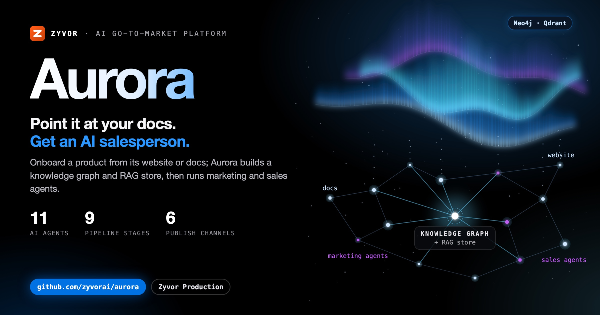

### Point it at your docs. Get an AI salesperson.

**Turn your technical product into an AI-powered salesperson.** A multi-tenant SaaS platform where software companies onboard by providing a website or documentation. The platform automatically discovers the product, builds a searchable knowledge graph + RAG store, then runs AI marketing, sales, and solution agents.

**11 specialized agents** · **9-stage GTM pipeline** · **6 publish channels** · **Ollama or OpenAI-compatible** · **Neo4j + Qdrant grounding**

</div>

---

## Why Aurora

| When this happens… | Aurora gives you… |
|---|---|
| Your product is technical and your sales team can't keep up with it | Agents grounded in a knowledge graph (Neo4j) and RAG store (Qdrant) built from your own website, docs, GitHub and OpenAPI spec |
| Marketing, sales and pre-sales each paste product facts into a different tool | One ingested knowledge base behind marketing strategy, content, sales chat, outreach, solution-architect Q&A and proposals |
| AI content goes out before anyone reads it | Human approval on every artifact; publishing is refused until the current content is approved |
| Outreach reaches people who opted out | A suppression list that blocks publish to suppressed recipients |
| Leadership asks "are we ready to sell this?" | An Executive Brief with a 9-signal `gtm_readiness` status, computed without an LLM call |
| You can't send product data to a hosted model | Ollama locally, or any OpenAI-compatible endpoint, switched by environment variables |

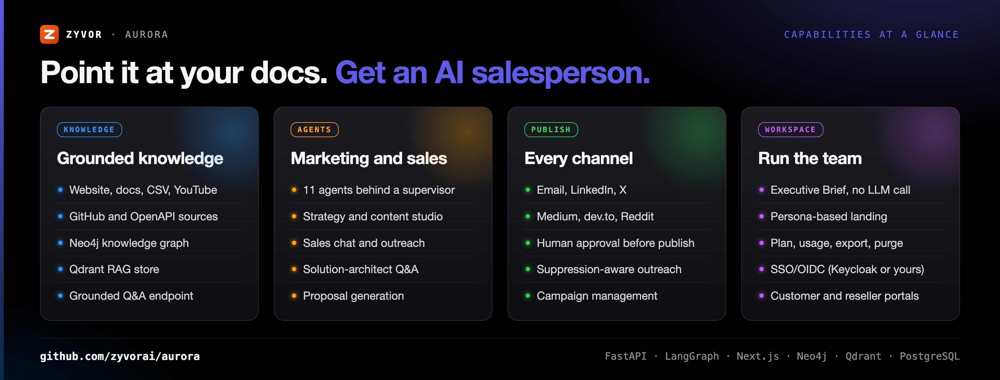

---

## Aurora vs point AI tools

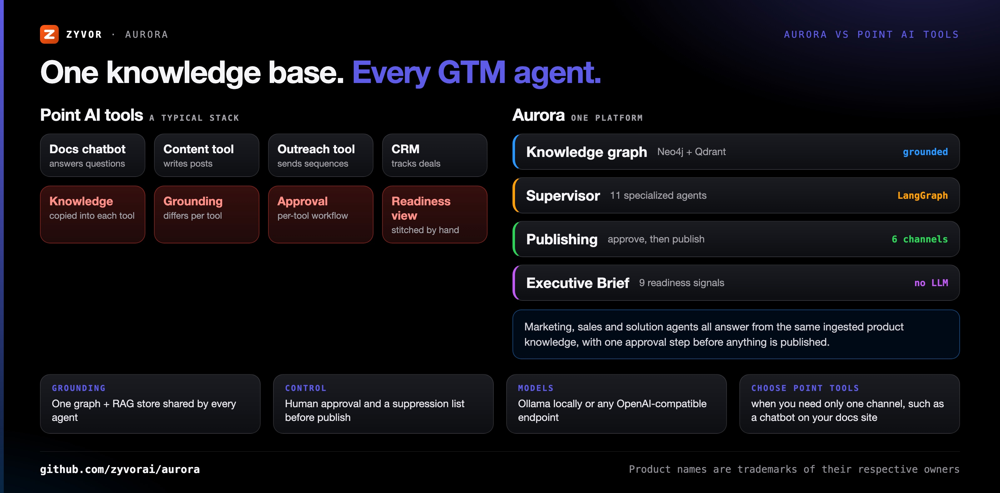

| | **Aurora** | **Point AI tools** (docs chatbot + content tool + outreach tool) |
|---|---|---|
| Product knowledge | Ingested once into a knowledge graph + RAG store | Loaded separately into each tool |
| Agents | 11 specialized agents behind one LangGraph supervisor | One assistant per tool |
| Sources | Website, docs, CSV, YouTube, GitHub, OpenAPI spec | Varies per tool |
| Before publishing | Approval tied to the artifact's content, plus a suppression list | Each tool's own workflow |
| Channels | Email, LinkedIn, X, Medium, dev.to, Reddit adapters | One or a few per tool |
| Readiness view | Executive Brief, 9 derived signals, no LLM call | Assembled by hand |
| Model choice | Ollama or OpenAI-compatible, per agent | Set by each vendor |
| **Choose point tools when** | | You need only one channel, such as a chatbot on your docs site |

---

## See it live

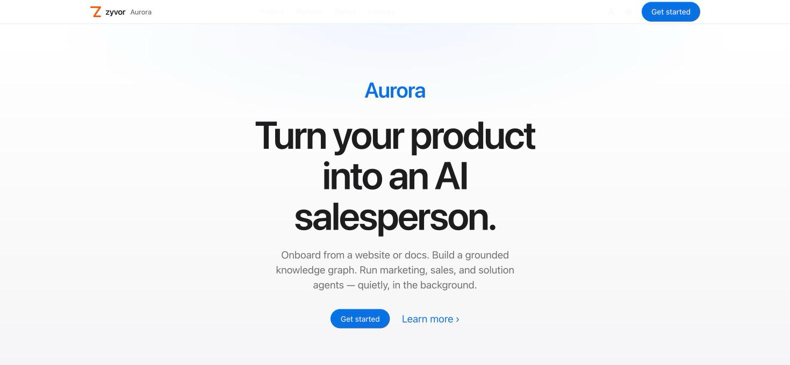

*Marketing home.*

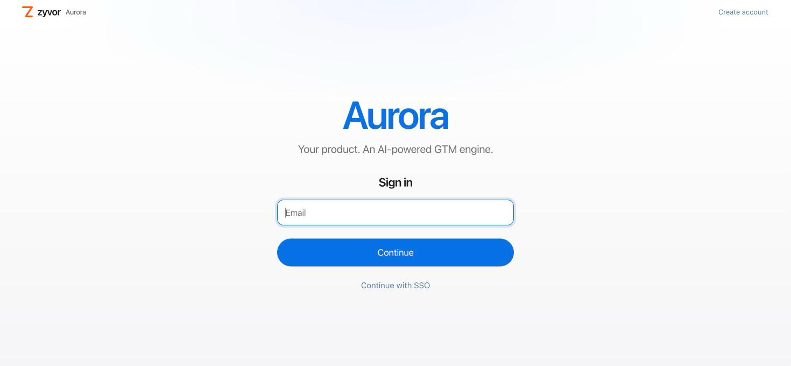

*Sign in: two-step email/password or SSO.*

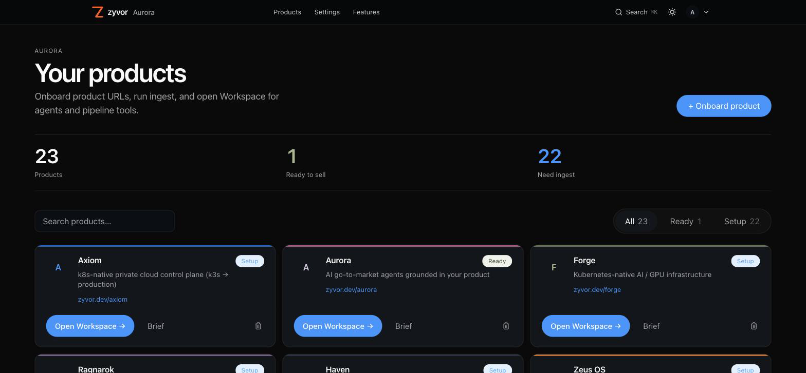

*GTM workspace: product portfolio with onboarding, search, and ready/setup filters.*

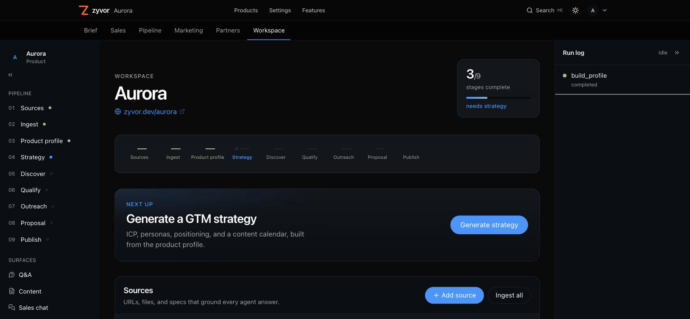

*The 9-stage GTM pipeline (Sources → Ingest → Strategy → … → Publish) with the run log dock.*

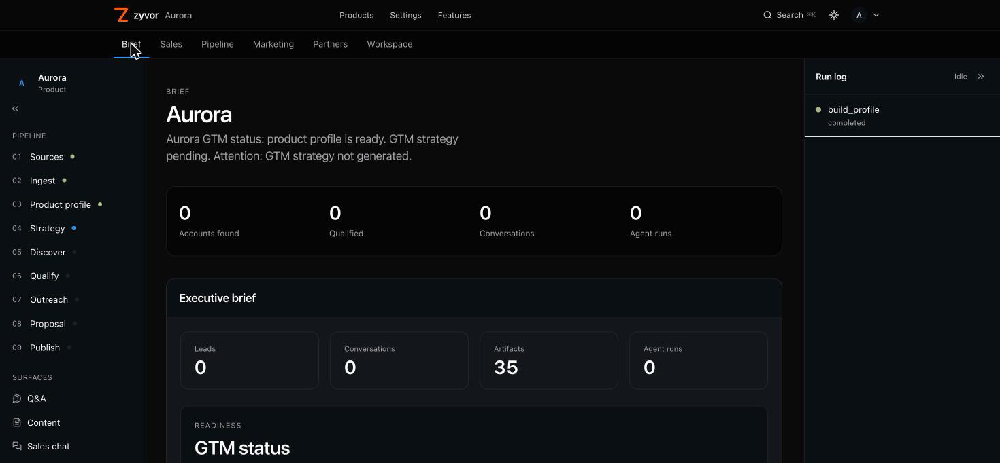

*Executive Brief: accounts, qualified leads, conversations, and GTM readiness, computed without an LLM call.*

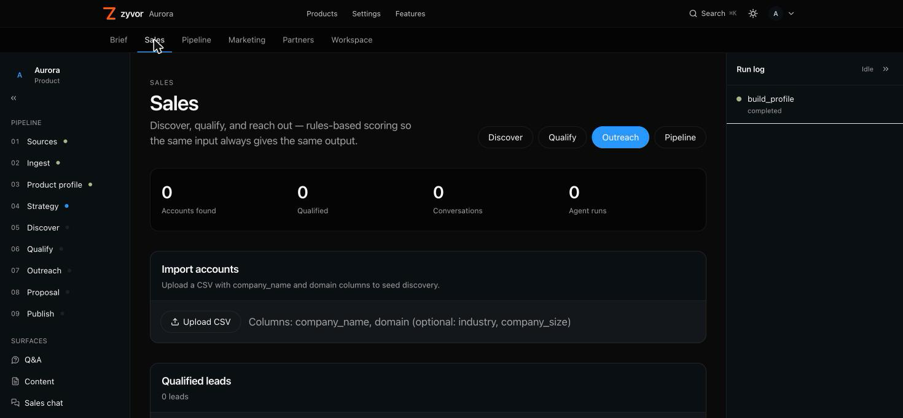

*Sales Action: Discover / Qualify / Outreach / Pipeline tabs for account discovery and CSV import.*

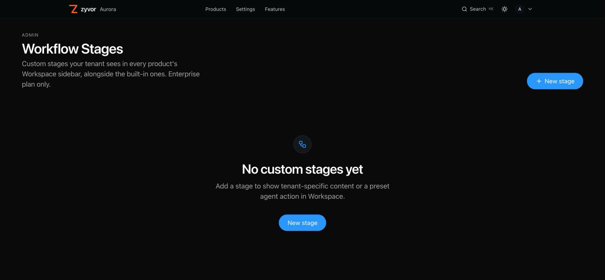

*Admin: Workflow Stages, an Enterprise-plan feature for tenant-defined pipeline stages.*

---

## How it fits together

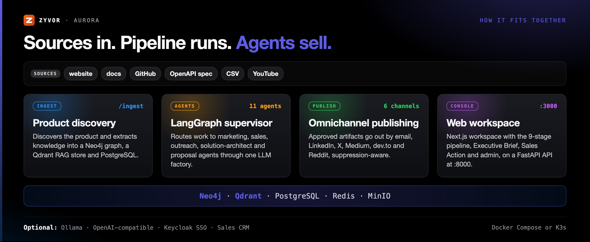

```text
Customer Sources → Product Discovery → Knowledge Extraction → AI Knowledge Graph
                                                                    ↓
                    Marketing AI ← Supervisor → Sales AI → Solution AI
                                    ↓
                    Omnichannel Publishing → Analytics → Continuous Learning
```

### Stack

| Layer | Technology |
|-------|------------|
| Frontend | Next.js, React, Tailwind CSS |
| Backend | FastAPI (Python) |
| Agents | LangChain, LangGraph |
| LLM (dev) | Ollama (`--profile ollama`) or OpenAI-compatible |
| LLM (lab / Zyvor-owned) | OpenAI-compatible chat (e.g. Groq) via `LLM_PROVIDER=openai` |
| LLM (customer prod) | OpenAI or your compatible gateway |
| Vector DB | Qdrant |
| Knowledge Graph | Neo4j |
| Relational DB | PostgreSQL |
| Cache/Queue | Redis |
| Object Storage | MinIO |

### Repository

| Path | What's there |
|------|---------------|
| [`apps/web`](apps/web) | Next.js/React frontend — marketing site, dashboard, product workspace. |
| `apps/api` | FastAPI backend — agents, knowledge graph/RAG, admin APIs. |
| [`apps/sales-crm`](apps/sales-crm/README.md) | Standalone Go lead/deal-pipeline CRM microservice — own SQLite DB, not wired to the platform pipeline. |
| [`docs/`](docs/README.md) | Operator/developer docs — dev guide, licensing, LLM integration, SSO, test cases. |
| [`docs/customer/`](docs/customer/README.md) | Customer-facing docs: getting started, page-by-page guides, printable PDFs. |
| [`k8s/`](k8s/README.md) | K3s manifests for the standalone production deploy (HTTPS `:30443`). |
| `infra/` | Docker Compose stack, Keycloak realm, optional nginx TLS overlay. |
| `scripts/` | Remote/K8s deploy, demo-suite seeding, and `docs/customer/` generation scripts. |

The public docs site at [zyvor.dev/aurora](https://zyvor.dev/aurora) is
synced from `docs/customer/` via `scripts/customer-docs/sync-to-website.mjs`
— edit the markdown here, not the live site.

---

## Quickstart

**Requires Docker Desktop running.**

```bash
make start    # infra + DB + API + web (background)
# → http://localhost:3000  (web)
# → http://localhost:8000  (api)
# Sign in (2-step): marketing@zyvor.dev → Continue → Admin@321
make stop     # when done
```

Full install paths (containerized/production, remote K3s, sales CRM), demo
logins, and a page-by-page nav table: **[QUICKSTART.md](QUICKSTART.md)**.
Full local setup and troubleshooting: [docs/dev-guide.md](docs/dev-guide.md).

### Which repo am I in?

| You want to… | Use |
|--------------|-----|
| **Non-production use** (free under the Zyvor Production License) | This repo — `make start` above |
| **Production / commercial license** | [https://zyvor.dev](https://zyvor.dev) |
| Product marketing / schedule a demo | [zyvor.dev/aurora](https://zyvor.dev/aurora) |

This repository is licensed under the **Zyvor Production License v1.0**. Non-production use is free. Production use needs a [commercial license](https://zyvor.dev).

---

## Features

### Knowledge & discovery

- Onboard a product from a website, docs, CSV, YouTube, GitHub, or an
  OpenAPI spec — see [docs/source-management.md](docs/source-management.md).
- Automatic knowledge graph (Neo4j) + RAG store (Qdrant) built from ingested
  sources, with grounded Q&A (`POST /products/{id}/query`).

### AI sales & marketing agents

- Marketing strategy and content generation, sales chat, personalized
  outreach (suppression-aware publish), solution-architect Q&A, and proposal
  generation — one LLM factory, swap Ollama ↔ OpenAI-compatible per agent.
  See [docs/ollama-llm-integration.md](docs/ollama-llm-integration.md).
- 11 specialized agents behind a supervisor, lean-hardware-first design. See
  [docs/multi-agent-composition-plan.md](docs/multi-agent-composition-plan.md).
- Campaign management and channel publishing across email, LinkedIn, X,
  Medium, dev.to, and Reddit adapters.

### Workspace & admin

- Persona-based default landing after login (exec / sales / marketing). See
  [docs/role-based-landing.md](docs/role-based-landing.md).
- Executive Brief with a 9-signal `gtm_readiness` status — computed without
  an LLM call on load.
- Admin: plan/usage, suppression list, tenant data export, tenant purge,
  and Enterprise-plan custom workflow stages.
- Customer / reseller / salesperson external portals.
- Optional standalone Sales CRM microservice
  ([`apps/sales-crm`](apps/sales-crm/README.md)) — Kanban pipeline, SLA
  timers, round-robin owners; independent of the built-in opportunities
  pipeline.
- SSO/OIDC — bundled Keycloak demo IdP or bring your own IdP. See
  [docs/sso-oidc.md](docs/sso-oidc.md).

## LLM Providers

The platform supports **both Ollama and OpenAI** via a single factory. Switch with env vars only:

| Setting | Ollama (dev default) | OpenAI (production) |
|---------|----------------------|---------------------|
| `LLM_PROVIDER` | `ollama` | `openai` |
| Chat models | Llama/Qwen/DeepSeek/Gemma per agent | GPT-4o / GPT-4o-mini per agent |
| Embeddings | `nomic-embed-text` (768d) | `text-embedding-3-small` (1536d) |
| Cost | Free (local compute) | Pay-per-token |

If `OPENAI_API_KEY` is set and `LLM_PROVIDER` is unset, OpenAI is auto-selected for backward compatibility.

Per-agent model routing:

| Agent | Ollama | OpenAI |
|-------|--------|--------|
| Product Understanding | qwen2.5-coder:14b | gpt-4o-mini |
| Marketing Strategy | deepseek-r1:8b | gpt-4o |
| Sales Chat | llama3.1:8b | gpt-4o-mini |
| Outreach | gemma2:9b | gpt-4o-mini |
| Solution Architect | deepseek-r1:8b | gpt-4o |

Check provider status: `GET /health`

Full plan, architecture, unit tests, and integration test guide: [docs/ollama-llm-integration.md](docs/ollama-llm-integration.md)

**Test case document (223 tests):** [docs/test-cases.md](docs/test-cases.md)

Multi-agent composition plan (11 specialized agents, **lean hardware / persona-first**): [docs/multi-agent-composition-plan.md](docs/multi-agent-composition-plan.md)

## API Endpoints

- `POST /api/v1/auth/register` — Register tenant
- `POST /api/v1/products` — Onboard product
- `POST /api/v1/products/{id}/sources` — Add source
- `POST /api/v1/products/{id}/ingest` — Trigger ingestion
- `GET /api/v1/products/{id}/profile` — Product profile
- `POST /api/v1/products/{id}/query` — Grounded Q&A
- `POST /api/v1/products/{id}/strategy` — Generate GTM strategy
- `POST /api/v1/products/{id}/content` — Generate content
- `POST /api/v1/products/{id}/chat` — Sales agent chat
- `POST /api/v1/products/{id}/outreach` — Personalized outreach (optional `recipient_email` for suppression-aware publish)
- `POST /api/v1/products/{id}/architect` — Solution architect Q&A
- `POST /api/v1/products/{id}/proposals` — Generate proposal
- `POST /api/v1/artifacts/{id}/approve` — Approve/reject generated content
- `POST /api/v1/artifacts/{id}/publish` — Publish to a channel (blocked if recipient is suppressed)
- `POST /api/v1/products/{id}/campaigns`, `GET .../campaigns`, `GET .../campaigns/{id}/status` — Campaign management
- `GET /api/v1/products/{id}/opportunities/{opp_id}` — Opportunity detail
- `GET /api/v1/products/{id}/account-health` — Customer success account health
- `GET /api/v1/products/{id}/brief` — Executive brief incl. `gtm_readiness` (9 derived, no-LLM status booleans — sources/ingest/profile/strategy/discover/qualify/outreach/proposal/publish)
- `GET /api/v1/products/{id}/workflow-runs` — Recent/active `WorkflowRun`s for a product (powers the Workspace run-log dock)
- `GET /api/v1/agents/registry` — Agent registry catalog
- `GET /api/v1/admin/plan` — Plan + usage
- `GET/POST /api/v1/admin/suppression` — Suppression list
- `GET /api/v1/admin/export` — Tenant data export (admin only)
- `POST /api/v1/admin/purge` — Tenant knowledge purge, typed-slug confirmation (admin only)
- `GET/POST/PUT/DELETE /api/v1/admin/workflow-stages` — Tenant-defined custom Workspace stages (Enterprise plan only)

## Design system

Light-first **Apple.com-style** system: Apple-blue primary (`--primary` `#0071e3`),
Mist Blue / Sage / Lavender / Deep Blue accents, SF/system typography, and pill CTAs in
`apps/web/src/app/globals.css`. Dark mode is a real, explicit opt-in (toggle lives only in
the app-shell nav; marketing and portal auth stay light regardless of the visitor's OS
preference or the toggle's stored state) via `html.dark-theme` (`ThemeContext`). One
shared `Card`/`Badge`/`StatGrid`/`Container` primitive set backs cards, status pills,
metric tiles, and page-width containers app-wide — legacy `.glass*` class names remain as
thin **aliases** for the same flat Apple panels (hairline border, no decorative shadow by
default); the earlier `.tahoe-*` glass-morphism direction has been fully removed.

**Chrome:** `GlobalNav` (mega-menu flyouts) sits on marketing (`MarketingLayout`), app
(`AppShell`), product console (`ProductConsoleShell`), and portal auth pages. Marketing
home is `/` (`HomeSections`); sign-up/sign-in live at `/login` with the same Apple-blue
auth language as `PortalAuthShell`. New tenants get an
`OnboardingChecklist` on `/dashboard` and Workspace until sources are ingested and an
agent has run.

The product workspace (`/products/[id]/*`) keeps a left rail + top tab bar under that same
`GlobalNav`, built around a derived 9-stage pipeline chain. See
[Frontend workspace](docs/gtm-platform-phases.md#frontend-workspace).

## Important boundaries

What's free under the Zyvor Production License vs. what needs a commercial license
([full guide](docs/LICENSING.md)):

| Use case | Allowed without a paid license? |
| --- | --- |
| Development, testing, evaluation, research, education | Yes |
| Non-production laboratory and proof-of-concept use | Yes |
| Production environments and customer workloads | No — needs a commercial license |
| SaaS, managed services, OEM, appliances | No — needs a commercial license |

`apps/sales-crm` and the platform's built-in opportunities pipeline are
deliberately independent services — don't assume one implies the other.

---

## Maturity

From the [12-phase implementation guide](docs/gtm-platform-phases.md) (status, acceptance criteria and test matrix):

| Status | Phases |
|---|---|
| **Complete** | Multi-Agent Supervisor |
| **MVP** | Product Understanding, Marketing Intelligence, Content Studio + HITL, Sales Agent + Chat Widget, Personalized Outreach, Omnichannel Publishing, Solution Architect, Proposal Generator, Analytics, Continuous Learning, Enterprise |

---

## Part of the Zyvor stack

| Product | Role next to Aurora |
|---|---|
| **Aurora** | AI go-to-market platform: knowledge graph + RAG, marketing, sales and solution agents |
| **[Argus](https://github.com/zyvorai/zyvorai-argus)** | Autonomous QA; sits next to Aurora among the Zyvor AI products |
| **[Aether](https://github.com/zyvorai/Aether)** | Runtime portability plane on the infrastructure side of the Zyvor stack (no Aurora integration) |
| **[Atlas](https://github.com/zyvorai/zyvor-atlas)** | Storage control plane on the infrastructure side of the Zyvor stack (no Aurora integration) |

→ [zyvor.dev](https://zyvor.dev)

---

## License

Aurora is source-available under the **[Zyvor Production License v1.0](LICENSE)** (SPDX `LicenseRef-Zyvor-Production-1.0`).

- **Free** for development, testing, evaluation, research, education, and non-production labs.
- **Production use** (production, customer workloads, SaaS, managed services, OEM, and redistribution) requires an annual enterprise subscription. Plans, support levels and terms: [docs/SUBSCRIPTION-MODEL.md](docs/SUBSCRIPTION-MODEL.md) · [licensing guide](docs/LICENSING.md) · [Pricing](https://zyvor.dev/pricing?utm_source=github&utm_medium=aurora&utm_campaign=readme_license) · [sales@zyvor.dev](mailto:sales@zyvor.dev).

Commercial terms: [https://zyvor.dev](https://zyvor.dev).

Contributions: [CONTRIBUTING.md](CONTRIBUTING.md). Report vulnerabilities privately per [SECURITY.md](SECURITY.md).

---

<div align="center">

### Give your product a salesperson who read the docs

[](https://zyvor.dev/schedule?utm_source=github&utm_medium=aurora&utm_campaign=readme_footer)
[](https://zyvor.dev/poc?utm_source=github&utm_medium=aurora&utm_campaign=readme_footer)
[](https://zyvor.dev/pricing?utm_source=github&utm_medium=aurora&utm_campaign=readme_footer)
[](mailto:sales@zyvor.dev?subject=Aurora)
[](https://github.com/zyvorai/aurora)

</div>
