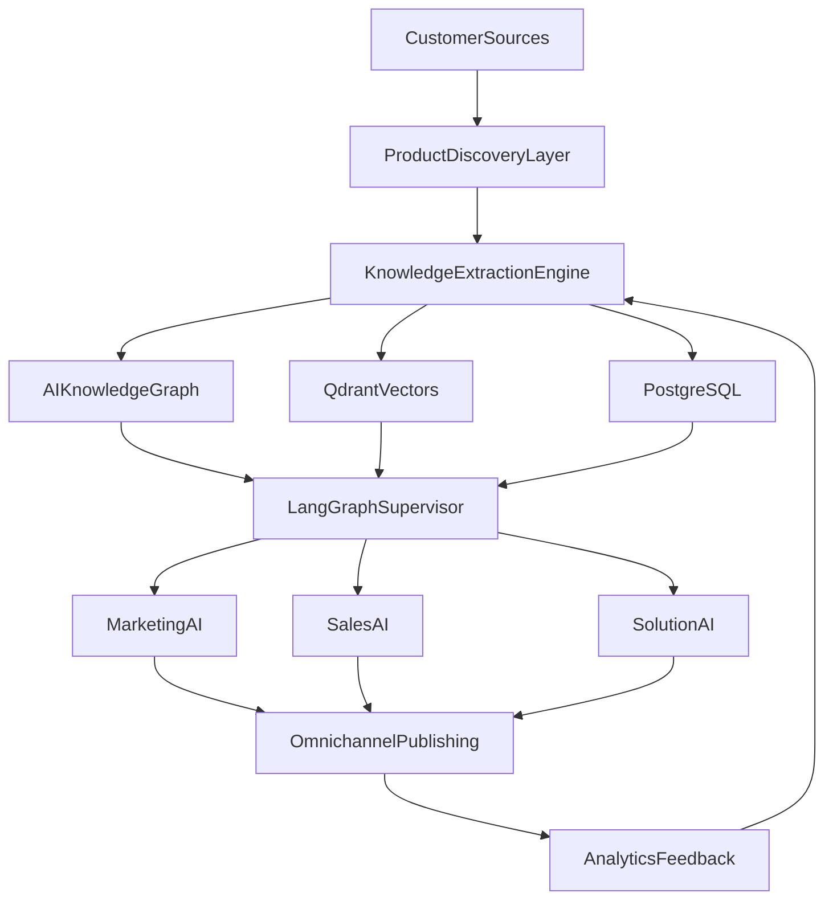

# GTM Agent Platform — 12-Phase Implementation Guide

Multi-tenant SaaS platform where software companies onboard with a website or documentation URL. The platform builds a grounded knowledge base and runs AI marketing, sales, and solution agents.

**Status legend:** ✅ Complete · ⚠️ Partial / MVP · ❌ Stub / Not started

---

## Architecture overview



---

## Phase scorecard

| Phase | Name | Status | Primary code | API endpoints |
|-------|------|--------|--------------|---------------|
| 1 | Product Understanding Engine | ⚠️ MVP | `agents/product_understanding.py`, `services/ingestion.py` | `POST /products`, `/sources`, `/ingest`, `/understand`, `/query` |
| 2 | Marketing Intelligence | ⚠️ MVP | `agents/marketing_strategy.py` | `POST /products/{id}/strategy` |
| 3 | Content Studio + HITL | ⚠️ MVP | `agents/content_studio.py`, `services/citation_gate.py` | `POST /products/{id}/content`, `/artifacts/{id}/approve` |
| 4 | Sales Agent + Chat Widget | ⚠️ MVP | `agents/sales_agent.py`, `components/ChatWidget.tsx` | `POST /products/{id}/chat` |
| 5 | Personalized Outreach | ⚠️ MVP | `agents/outreach.py` | `POST /products/{id}/outreach` |
| 6 | Omnichannel Publishing | ❌ Stub | `services/publishing.py` | `POST /artifacts/{id}/publish` |
| 7 | Solution Architect | ⚠️ MVP | `agents/solution_architect.py` | `POST /products/{id}/architect` |
| 8 | Proposal Generator | ⚠️ MVP | `agents/proposal_generator.py` | `POST /products/{id}/proposals` |
| 9 | Analytics | ⚠️ MVP | `services/analytics.py` | `GET /products/{id}/analytics` |
| 10 | Continuous Learning | ⚠️ MVP | `services/learning.py`, `workers/` | `POST /products/{id}/refresh` |
| 11 | Multi-Agent Supervisor | ❌ Stub | `agents/supervisor.py` | `POST /products/{id}/supervisor` |
| 12 | Enterprise | ⚠️ MVP | `services/enterprise.py`, `auth.py` | `GET /audit`, RBAC on all routes |

---

## Phase 1 — AI Product Understanding Engine

**Goal:** Deep, searchable product intelligence from heterogeneous sources.

### Implemented ✅

- Multi-tenant FastAPI skeleton with JWT auth and RBAC
- SSRF-safe web crawler (`services/crawler.py`)
- Chunk → embed → Qdrant pipeline with tenant-scoped filters
- Neo4j knowledge graph with tenant isolation (`services/knowledge_graph.py`)
- LangGraph `ProductUnderstandingAgent` — profile + entity extraction
- APIs: create product, add sources, ingest, understand, query, get profile

### Gaps ⚠️

| Planned | Current |
|---------|---------|
| Playwright for JS-heavy sites | httpx + BeautifulSoup only |
| GitHub, PDF, DOCX, PPT, video, OpenAPI loaders | Enum exists; only WEBSITE/DOCS/BLOG ingested |
| Background crawl via Redis queue | Synchronous ingest in API; workers exist but not wired |
| Unstructured.io, Whisper, diagram OCR | Not implemented |

### Acceptance criteria

- [x] Tenant can onboard a product with a website URL
- [x] Crawl produces chunks in Qdrant with `tenant_id` filter
- [x] Product profile extracted and stored in Postgres
- [x] Grounded Q&A returns citations
- [ ] GitHub/PDF/video sources ingest successfully
- [ ] Ingest runs asynchronously via worker queue

### Tests

| Test | File | Status |
|------|------|--------|
| Chunk text splitting | `tests/test_api.py::TestChunking` | ✅ |
| Citation grounding | `tests/test_api.py::TestCitationGate` | ✅ |
| Crawler SSRF block | — | ❌ Missing |
| Ingest end-to-end | — | ❌ Missing |
| Tenant isolation (Qdrant) | — | ❌ Missing |

---

## Phase 2 — Marketing Intelligence Agent

**Goal:** GTM strategy artifacts grounded on product KB.

### Implemented ✅

- `MarketingStrategyAgent` LangGraph workflow
- Outputs: GTM strategy, ICP, personas, positioning, messaging, SEO keywords, content calendar
- Artifacts versioned in Postgres

### Gaps ⚠️

- Citations returned empty from API
- No strategy workspace UI (edit / lock as brand context)
- No competitive intel from external sources

### Acceptance criteria

- [x] Generate strategy from ingested product KB
- [x] Store as versioned artifact
- [ ] Strategy editable and lockable as brand context
- [ ] Citations populated from KB chunks

### Tests

| Test | Status |
|------|--------|
| Strategy agent (mocked LLM) | ❌ Missing |
| Artifact persistence | ❌ Missing |

---

## Phase 3 — AI Content Studio

**Goal:** Grounded content generation with human-in-the-loop approval.

### Implemented ✅

- `ContentStudioAgent` with RAG + citation gate
- Content types: LinkedIn, blog, email, X thread (via `content_type` param)
- Approval workflow: `POST /artifacts/{id}/approve`
- Publish blocked until approved

### Gaps ⚠️

- No multi-language or SEO scoring
- No dedicated content review UI
- Tone/persona params exist but UI uses defaults

### Acceptance criteria

- [x] Generate grounded content draft
- [x] Citation gate blocks ungrounded claims
- [x] Approval required before publish
- [ ] Multi-language generation
- [ ] SEO scoring

### Tests

| Test | Status |
|------|--------|
| Citation gate | ✅ `TestCitationGate` |
| Content generation (mocked LLM) | ❌ Missing |
| Approval → publish gate | ❌ Missing |

---

## Phase 4 — AI Sales Agent

**Goal:** Conversational RAG sales assistant with embeddable widget.

### Implemented ✅

- `SalesAgent` LangGraph with grounded RAG, lead scoring, conversation history
- `POST /products/{id}/chat` API
- Embeddable `ChatWidget.tsx` component
- Frontend chat tab in product workspace

### Gaps ⚠️

- No WebSocket/SSE streaming
- ChatWidget not auto-mounted on product page (use tab or embed manually)
- BANT lead qualification not tested

### Acceptance criteria

- [x] Chat returns grounded answers with citations
- [x] Conversation persisted per session
- [x] Embeddable widget component exists
- [ ] Streaming responses
- [ ] Lead qualification scoring validated

### Tests

| Test | Status |
|------|--------|
| Sales chat (mocked LLM) | ❌ Missing |
| Lead score computation | ❌ Missing |

### Widget embed

```tsx
import ChatWidget from '@/components/ChatWidget';

<ChatWidget productId="your-product-uuid" apiUrl="/api" />
```

---

## Phase 5 — Personalized Outreach Engine

**Goal:** Research prospect → pain detection → personalized email drafts.

### Implemented ✅

- `OutreachAgent` LangGraph workflow
- Company analysis, pain points, product fit, email draft, follow-up sequence
- Draft-only (requires approval before send)

### Gaps ⚠️

- No LinkedIn/public signal research
- No campaign management
- Prospect dossier depth limited to LLM + company URL crawl

### Acceptance criteria

- [x] Generate outreach draft from company URL
- [x] Follow-up sequence included
- [ ] LinkedIn / public signal enrichment
- [ ] Campaign tracking

### Tests

| Test | Status |
|------|--------|
| Outreach agent (mocked LLM) | ❌ Missing |

---

## Phase 6 — Omnichannel Publishing

**Goal:** Publish approved content to LinkedIn, X, Medium, blog CMS, email, etc.

### Implemented ⚠️ (stub)

- Approval gate before publish
- Idempotency keys on `ChannelPost`
- Channel name registry (LinkedIn, X, Medium, Dev.to, Reddit, blog, newsletter, email)

### Gaps ❌

- **Mock publish only** — no real connector APIs
- No scheduler or retry queue
- No A/B variants or engagement prediction
- No publishing dashboard UI

### Acceptance criteria

- [x] Publish blocked without approval
- [x] Idempotent publish records
- [ ] Real LinkedIn/X/Medium connector (or pluggable adapter interface)
- [ ] Scheduled publish via worker
- [ ] Failed publish retry

### Tests

| Test | Status |
|------|--------|
| Approval gate | ❌ Missing |
| Idempotency | ❌ Missing |

---

## Phase 7 — AI Solution Architect

**Goal:** Technical pre-sales assistant with architecture diagrams and deployment plans.

### Implemented ✅

- `SolutionArchitectAgent` with RAG + citation gate
- Mermaid architecture diagrams in response
- Deployment plan and security notes
- Frontend Architect tab in product workspace

### Gaps ⚠️

- No diagram export (PNG/PDF)
- No cost estimation module

### Acceptance criteria

- [x] Answer technical pre-sales questions with citations
- [x] Return Mermaid diagram when applicable
- [ ] Export diagram as image/PDF

### Tests

| Test | Status |
|------|--------|
| Architect agent (mocked LLM) | ❌ Missing |

---

## Phase 8 — AI Proposal Generator

**Goal:** One-click proposal packs with PDF/DOCX/PPTX export.

### Implemented ⚠️

- `ProposalGeneratorAgent` — proposal, SOW, ROI, pricing, timeline
- Artifacts stored in Postgres
- Frontend Proposal tab in product workspace

### Gaps ❌

- `python-docx`, `python-pptx`, `weasyprint` in dependencies but **not wired**
- No file download endpoint

### Acceptance criteria

- [x] Generate proposal JSON artifact from scope + KB
- [ ] Export PDF
- [ ] Export DOCX
- [ ] Export PPTX

### Tests

| Test | Status |
|------|--------|
| Proposal agent (mocked LLM) | ❌ Missing |
| PDF/DOCX export | ❌ Missing |

---

## Phase 9 — AI Analytics

**Goal:** Funnel metrics, engagement, knowledge gaps.

### Implemented ✅

- `MetricEvent` emission on queries (including ungrounded blocks)
- Funnel: visitors → content views → conversations → leads → artifacts → agent runs
- Top questions and knowledge gap feeds
- Analytics tab in product workspace

### Gaps ⚠️

- No meetings/closed-deals tracking
- No email open/CTR metrics
- Events depend on consistent emission across agents

### Acceptance criteria

- [x] Analytics API returns funnel + knowledge gaps
- [x] Ungrounded queries tracked as gaps
- [ ] Full sales funnel (meetings → proposals → closed)
- [ ] Email engagement metrics

### Tests

| Test | Status |
|------|--------|
| Analytics aggregation | ❌ Missing |
| Event emission | ❌ Missing |

---

## Phase 10 — Continuous Learning Engine

**Goal:** Monitor source changes, re-embed, refresh stale assets.

### Implemented ⚠️

- Source change detection via content hash
- `refresh_product` re-ingests changed sources
- Worker job `refresh_product_knowledge`
- `POST /products/{id}/refresh` API

### Gaps ⚠️

- No scheduled cron / drift alerts
- Stale artifacts counted but not auto-regenerated
- No GitHub/release-notes monitoring

### Acceptance criteria

- [x] Detect changed source URLs and re-ingest
- [x] Worker can run refresh job
- [ ] Scheduled refresh per product
- [ ] Auto-regenerate stale marketing assets as drafts

### Tests

| Test | Status |
|------|--------|
| Source change detection | ❌ Missing |
| Refresh re-ingest | ❌ Missing |

---

## Phase 11 — Multi-Agent Supervisor

**Goal:** Single orchestration runtime routing to all agent subgraphs.

### Implemented ❌ (routing shell only)

- LangGraph supervisor with request-type → agent routing table
- `POST /products/{id}/supervisor` endpoint

### Critical gap

Execute nodes return `{"status": "routed"}` — they **do not invoke** real agents. Direct router endpoints remain the primary execution path.

### Acceptance criteria

- [x] Routing table maps request types to agents
- [ ] Supervisor dispatches to real agent implementations
- [ ] Shared memory across agent calls
- [ ] Tool registry (search_kb, create_artifact, schedule_post)

### Tests

| Test | Status |
|------|--------|
| Route mapping | ❌ Missing |
| End-to-end dispatch | ❌ Missing |

---

## Phase 12 — Enterprise Features

**Goal:** SSO, RBAC, audit, compliance, private deploy.

### Implemented ⚠️

- JWT auth with bcrypt
- RBAC roles: admin, editor, approver, viewer
- Audit logs on key actions
- Plan tiers: starter / growth / enterprise with product limits
- Suppression list, tenant purge, data export

### Gaps ❌

- No SSO (Auth0/Keycloak) — `sso: true` is a plan flag only
- No public API keys
- No private/VPC deploy tooling
- No SOC2/GDPR compliance modules

### Acceptance criteria

- [x] RBAC enforced on write/approve/publish routes
- [x] Immutable audit trail queryable via `GET /audit`
- [x] Product limits per plan tier
- [ ] SSO integration
- [ ] API key authentication
- [ ] Private deployment guide

### Tests

| Test | Status |
|------|--------|
| Plan feature flags | ✅ `TestEnterprise::test_plan_features` |
| RBAC enforcement | ❌ Missing |
| Audit log creation | ❌ Missing |

---

## Cross-cutting: LLM providers

Dual-provider layer (Ollama + OpenAI) documented in [ollama-llm-integration.md](./ollama-llm-integration.md).

- Default dev: Ollama (free, local)
- Production: OpenAI (GPT-4o / GPT-4o-mini)
- Per-agent model routing via env vars
- 15 tests (6 unit + 9 integration) in `tests/test_api.py` and `tests/test_llm_integration.py`

---

## Test matrix summary

| Category | Tests | Passing |
|----------|-------|---------|
| Auth utilities | 3 | ✅ |
| Chunking | 2 | ✅ |
| Citation gate | 2 | ✅ |
| Enterprise plan flags | 1 | ✅ |
| LLM factory (unit) | 6 | ✅ |
| LLM integration | 9 | ✅ |
| **Total** | **23** | **✅** |

### Recommended next tests

1. `test_crawler_blocks_private_ips` — SSRF validation
2. `test_ingest_pipeline` — crawl → chunk → embed (mocked externals)
3. `test_approval_blocks_publish` — Phase 3 + 6 gate
4. `test_tenant_isolation_qdrant` — cross-tenant search returns empty
5. `test_supervisor_dispatches_strategy` — Phase 11 wiring
6. `test_api_products_crud` — FastAPI TestClient with auth

Run all tests:

```bash
make test
# or
cd apps/api && python -m pytest tests/ -v
```

---

## Frontend workspace

Product workspace tabs (`apps/web/src/app/products/[id]/page.tsx`):

| Tab | Phase | API |
|-----|-------|-----|
| Overview | 1 | ingest, understand, profile |
| Q&A | 1 | query |
| Strategy | 2 | strategy |
| Content | 3 | content |
| Sales Chat | 4 | chat |
| Outreach | 5 | outreach |
| Architect | 7 | architect |
| Proposal | 8 | proposals |
| Analytics | 9 | analytics |

API client: `apps/web/src/lib/api.ts`

---

## Roadmap priorities

| Priority | Item | Phases |
|----------|------|--------|
| P0 | Wire supervisor to real agents | 11 |
| P0 | Add phase integration tests | All |
| P1 | Wire ingest to background workers | 1, 10 |
| P1 | PDF/DOCX proposal export | 8 |
| P1 | Real publishing adapter interface | 6 |
| P2 | GitHub/PDF source loaders | 1 |
| P2 | SSO (Auth0/Keycloak) | 12 |
| P2 | WebSocket chat streaming | 4 |
| P3 | Playwright crawler | 1 |
| P3 | Scheduled learning cron | 10 |

---

## Quick reference

```bash
make start    # infra + DB + API + web (background)
make stop     # stop processes + Docker
make test     # 23 tests
curl http://localhost:8000/health
```

Full local dev guide (setup, scripts, Makefile, troubleshooting): [dev-guide.md](./dev-guide.md)
