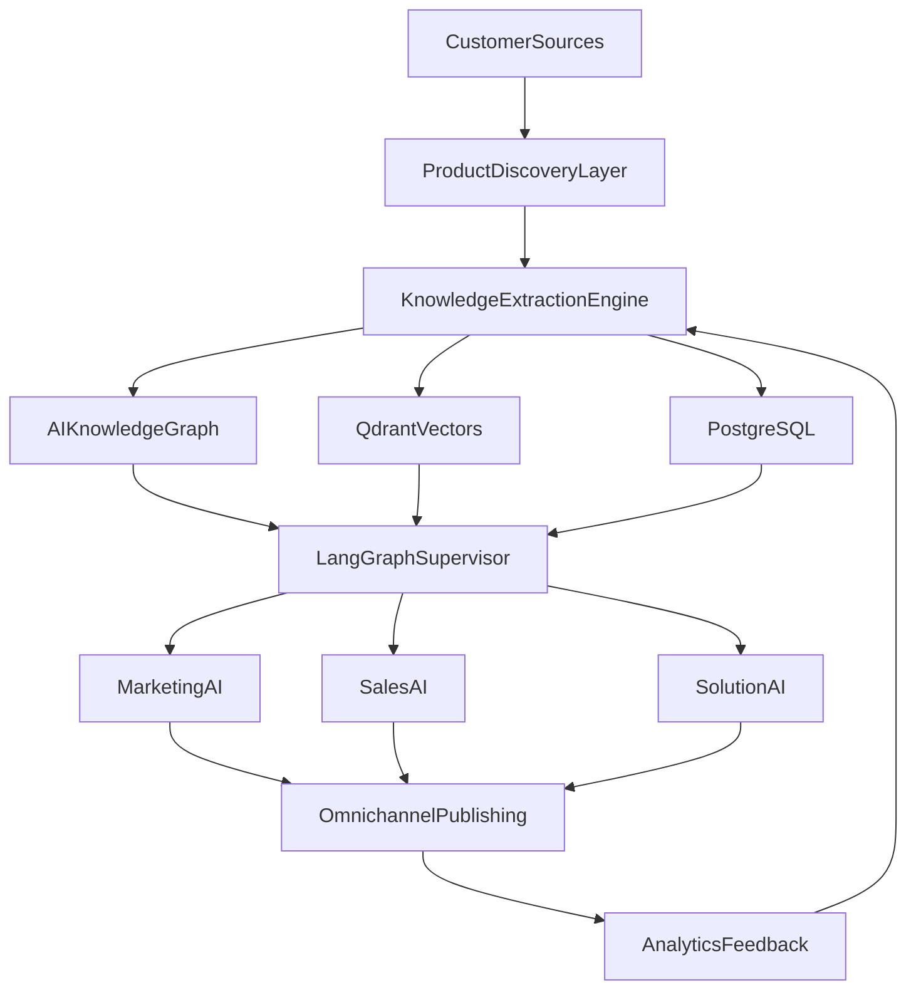

# Aurora — 12-Phase Implementation Guide

Multi-tenant SaaS platform where software companies onboard with a website or documentation URL. The platform builds a grounded knowledge base and runs AI marketing, sales, and solution agents.

**Status legend:** ✅ Complete · ⚠️ Partial / MVP · ❌ Stub / Not started

---

## Architecture overview



---

## Phase scorecard

| Phase | Name | Status | Primary code | API endpoints |
|-------|------|--------|--------------|---------------|
| 1 | Product Understanding Engine | ⚠️ MVP | `agents/product_understanding.py`, `services/ingestion.py` | `POST /products`, `/sources`, `/ingest`, `/understand`, `/query` |
| 2 | Marketing Intelligence | ⚠️ MVP | `agents/marketing_strategy.py` | `POST /products/{id}/strategy` |
| 3 | Content Studio + HITL | ⚠️ MVP | `agents/content_studio.py`, `services/citation_gate.py` | `POST /products/{id}/content`, `/artifacts/{id}/approve` |
| 4 | Sales Agent + Chat Widget | ⚠️ MVP | `agents/sales_agent.py`, `components/ChatWidget.tsx` | `POST /products/{id}/chat` |
| 5 | Personalized Outreach | ⚠️ MVP | `agents/outreach.py` | `POST /products/{id}/outreach` |
| 6 | Omnichannel Publishing | ⚠️ MVP | `services/publishing.py`, `services/publishing_adapters/` | `POST /artifacts/{id}/publish` |
| 7 | Solution Architect | ⚠️ MVP | `agents/solution_architect.py` | `POST /products/{id}/architect` |
| 8 | Proposal Generator | ⚠️ MVP | `agents/proposal_generator.py` | `POST /products/{id}/proposals` |
| 9 | Analytics | ⚠️ MVP | `services/analytics.py` | `GET /products/{id}/analytics` |
| 10 | Continuous Learning | ⚠️ MVP | `services/learning.py`, `workers/` | `POST /products/{id}/refresh` |
| 11 | Multi-Agent Supervisor | ✅ Complete | `agents/supervisor.py`, `agents/executor.py`, `agents/registry.py`, `agents/tools.py` | `POST /products/{id}/supervisor` |
| 12 | Enterprise | ⚠️ MVP | `services/enterprise.py`, `routers/admin.py`, `auth.py` | `GET /audit`, `GET /admin/plan`, `GET/POST /admin/suppression`, `GET /admin/export`, `POST /admin/purge`, RBAC on all routes |

---

## Phase 1 — AI Product Understanding Engine

**Goal:** Deep, searchable product intelligence from heterogeneous sources.

### Implemented ✅

- Multi-tenant FastAPI skeleton with JWT auth and RBAC
- SSRF-safe web crawler (`services/crawler.py`)
- Chunk → embed → Qdrant pipeline with tenant-scoped filters
- Neo4j knowledge graph with tenant isolation (`services/knowledge_graph.py`)
- LangGraph `ProductUnderstandingAgent` — profile + entity extraction
- APIs: create product, add sources, ingest, understand, query, get profile
- **Playwright JS-render fallback** (`services/crawler.py::_render_with_playwright`) — when
  the httpx+BeautifulSoup fetch yields a thin/SPA-shell page (below
  `CRAWLER_THIN_PAGE_CHAR_THRESHOLD`), re-fetches via headless Chromium and re-extracts.
  Opt-in and gated: `CRAWLER_USE_PLAYWRIGHT=true` plus `pip install
  'aurora-api[playwright]' && playwright install chromium` on the host — off by default
  since it's a heavy dependency; degrades to the plain httpx result on any failure
  (not installed, timeout, navigation error), never raises.

### Gaps ⚠️

| Planned | Current |
|---------|---------|
| GitHub, PDF, DOCX, PPT, video, OpenAPI loaders | Enum exists; only WEBSITE/DOCS/BLOG ingested |
| Unstructured.io, Whisper, diagram OCR | Not implemented |

Background crawl via Redis queue is done: `services/job_queue.py::enqueue_source_ingest()` +
`routers/products.py::trigger_ingest()` enqueue the worker's `crawl_source` job when
`async_mode=True` and Redis workers are enabled; `POST /products/{id}/refresh` (Phase 10)
now enqueues `refresh_product_knowledge` the same way via `enqueue_product_refresh()`.

### Acceptance criteria

- [x] Tenant can onboard a product with a website URL
- [x] Crawl produces chunks in Qdrant with `tenant_id` filter
- [x] Product profile extracted and stored in Postgres
- [x] Grounded Q&A returns citations
- [ ] GitHub/PDF/video sources ingest successfully
- [x] Ingest runs asynchronously via worker queue

### Tests

| Test | File | Status |
|------|------|--------|
| Chunk text splitting | `tests/test_api.py::TestChunking` | ✅ |
| Citation grounding | `tests/test_api.py::TestCitationGate` | ✅ |
| Crawler SSRF block | `tests/test_crawler.py::TestValidateUrl` | ✅ |
| Ingest end-to-end | `tests/test_ingestion.py::test_ingest_pipeline` | ✅ |
| Tenant isolation (Qdrant) | `tests/test_vector_store.py::test_tenant_isolation_qdrant` | ✅ |
| Playwright fallback (config-gated, degrades gracefully, thin-page trigger) | `tests/test_crawler_playwright.py` | ✅ |

---

## Phase 2 — Marketing Intelligence Agent

**Goal:** GTM strategy artifacts grounded on product KB.

### Implemented ✅

- `MarketingStrategyAgent` LangGraph workflow
- Outputs: GTM strategy, ICP, personas, positioning, messaging, SEO keywords, content calendar
- Artifacts versioned in Postgres

### Gaps ⚠️

- Citations returned empty from API
- No strategy workspace UI (edit / lock as brand context)
- No competitive intel from external sources

### Acceptance criteria

- [x] Generate strategy from ingested product KB
- [x] Store as versioned artifact
- [ ] Strategy editable and lockable as brand context
- [ ] Citations populated from KB chunks

### Tests

| Test | Status |
|------|--------|
| Strategy agent (mocked LLM) | ❌ Missing |
| Artifact persistence | ❌ Missing |

---

## Phase 3 — AI Content Studio

**Goal:** Grounded content generation with human-in-the-loop approval.

### Implemented ✅

- `ContentStudioAgent` with RAG + citation gate
- Content types: LinkedIn, blog, email, X thread (via `content_type` param)
- Approval workflow: `POST /artifacts/{id}/approve`
- Publish blocked until approved
- Content review + publish UI: `components/artifacts/ArtifactList.tsx` (Forge "Publish" tab) —
  approve/reject row actions, publish modal with channel select and a recipient-email field
  for email/newsletter channels

### Gaps ⚠️

- No multi-language or SEO scoring
- Tone/persona params exist but UI uses defaults

### Acceptance criteria

- [x] Generate grounded content draft
- [x] Citation gate blocks ungrounded claims
- [x] Approval required before publish
- [x] Content review/approve/publish UI
- [ ] Multi-language generation
- [ ] SEO scoring

### Tests

| Test | Status |
|------|--------|
| Citation gate | ✅ `TestCitationGate` |
| Content generation (mocked LLM) | ❌ Missing |
| Approval → publish gate | ❌ Missing |

---

## Phase 4 — AI Sales Agent

**Goal:** Conversational RAG sales assistant with embeddable widget.

### Implemented ✅

- `SalesAgent` LangGraph with grounded RAG, lead scoring, conversation history
- `POST /products/{id}/chat` API
- Embeddable `ChatWidget.tsx` component
- Frontend chat tab in product workspace

### Gaps ⚠️

- No WebSocket/SSE streaming
- ChatWidget not auto-mounted on product page (use tab or embed manually)
- BANT lead qualification not tested

### Acceptance criteria

- [x] Chat returns grounded answers with citations
- [x] Conversation persisted per session
- [x] Embeddable widget component exists
- [ ] Streaming responses
- [ ] Lead qualification scoring validated

### Tests

| Test | Status |
|------|--------|
| Sales chat (mocked LLM) | ❌ Missing |
| Lead score computation | ❌ Missing |

### Widget embed

```tsx
import ChatWidget from '@/components/ChatWidget';

<ChatWidget productId="your-product-uuid" apiUrl="/api" />
```

---

## Phase 5 — Personalized Outreach Engine

**Goal:** Research prospect → pain detection → personalized email drafts.

### Implemented ✅

- `OutreachAgent` LangGraph workflow
- Company analysis, pain points, product fit, email draft, follow-up sequence
- Draft-only (requires approval before send)
- Optional `recipient_email` on the outreach request, carried into the artifact's
  `metadata_` and used to pre-fill / suppression-check the eventual publish
- Campaign management: `POST/GET /products/{id}/campaigns`, `GET .../campaigns/{id}/status`
  (`routers/pipeline.py`), UI in `components/campaigns/CampaignsPanel.tsx` (Marketing page)

### Gaps ⚠️

- No LinkedIn/public signal research
- Prospect dossier depth limited to LLM + company URL crawl

### Acceptance criteria

- [x] Generate outreach draft from company URL
- [x] Follow-up sequence included
- [x] Campaign creation, listing, and status tracking (UI + API)
- [ ] LinkedIn / public signal enrichment

### Tests

| Test | Status |
|------|--------|
| Outreach agent (mocked LLM) | ❌ Missing |

---

## Phase 6 — Omnichannel Publishing

**Goal:** Publish approved content to LinkedIn, X, Medium, blog CMS, email, etc.

### Implemented ⚠️

- Approval gate before publish
- Idempotency keys on `ChannelPost`
- **Pluggable adapter interface** (`services/publishing_adapters/`, `PublishAdapter` protocol) —
  `publish_artifact()` dispatches to a per-channel adapter instead of a hardcoded mock
- **Real `email`/`newsletter` channel** via SMTP (`email_adapter.py`, configured with
  `SMTP_HOST`/`SMTP_USER`/`SMTP_PASSWORD`; degrades to `not_configured` when unset)
- **Per-prospect suppression enforcement** — `publish_artifact()` resolves the effective
  recipient (explicit `recipient` param → `artifact.metadata_.recipient_email` →
  `settings.email_channel_recipient` → `settings.smtp_from`) and checks `is_suppressed()`
  before dispatching to the adapter; blocked publishes are recorded as
  `ChannelPost.status = "blocked"` with an audit log entry, not silently dropped
- **Publish dashboard UI** — `components/artifacts/ArtifactList.tsx` (Forge "Publish" tab):
  approve/reject, publish-to-channel modal (channel select, scheduled-at, conditional
  recipient-email field), status badges
- **Real LinkedIn/X/Medium/Dev.to/Reddit connectors** (`publishing_adapters/oauth_adapters.py`)
  — real API calls once credentials are configured (`LINKEDIN_ACCESS_TOKEN`,
  `X_BEARER_TOKEN`, `MEDIUM_ACCESS_TOKEN`, `DEVTO_API_KEY`, `REDDIT_ACCESS_TOKEN`, etc.),
  degrading to `not_configured` otherwise — same convention as the SMTP adapter. `blog`
  remains a stub (no single target CMS platform to integrate against).
- **Publish scheduler + retry queue** (`services/publish_scheduler.py`) — ARQ cron jobs
  dispatch due `scheduled_at` posts every 5 min and retry failed posts every 15 min (up to
  5 attempts, exponential backoff via `ChannelPost.retry_count`/`next_retry_at`); both reuse
  the same `dispatch_channel_post()` suppression-check + adapter-call path as immediate publish

### Gaps ❌

- No A/B variants or engagement prediction

### Acceptance criteria

- [x] Publish blocked without approval
- [x] Idempotent publish records
- [x] Pluggable adapter interface (`PublishAdapter` protocol)
- [x] One real (non-OAuth) channel connector (email via SMTP)
- [x] Per-prospect suppression list enforced at publish time
- [x] Publishing dashboard UI (approve/publish/status)
- [x] Real LinkedIn/X/Medium/Dev.to/Reddit connectors (credential-gated)
- [x] Scheduled publish via worker
- [x] Failed publish retry

### Tests

| Test | File | Status |
|------|------|--------|
| Approval gate blocks publish | `tests/test_publishing.py::test_publish_blocked_without_approval` | ✅ |
| Idempotency dedup | `tests/test_publishing.py::test_publish_rejects_duplicate_idempotency_key` | ✅ |
| OAuth adapters (not_configured degrade + real call + error mapping) | `tests/test_oauth_adapters.py` | ✅ |
| Scheduled dispatch + retry backoff/exhaustion | `tests/test_publish_scheduler.py` | ✅ |
| Email adapter degrades without SMTP config | `tests/test_publishing.py::test_publish_email_channel_real_adapter_not_configured_without_smtp` | ✅ |
| Publish blocked when recipient suppressed | `tests/test_publishing.py::test_publish_email_blocked_when_recipient_suppressed` | ✅ |

---

## Phase 7 — AI Solution Architect

**Goal:** Technical pre-sales assistant with architecture diagrams and deployment plans.

### Implemented ✅

- `SolutionArchitectAgent` with RAG + citation gate
- Mermaid architecture diagrams in response
- Deployment plan and security notes
- Frontend Architect tab in product workspace

### Gaps ⚠️

- No diagram export (PNG/PDF)
- No cost estimation module

### Acceptance criteria

- [x] Answer technical pre-sales questions with citations
- [x] Return Mermaid diagram when applicable
- [ ] Export diagram as image/PDF

### Tests

| Test | Status |
|------|--------|
| Architect agent (mocked LLM) | ❌ Missing |

---

## Phase 8 — AI Proposal Generator

**Goal:** One-click proposal packs with PDF/DOCX/PPTX export.

### Implemented ✅

- `ProposalGeneratorAgent` — proposal, SOW, ROI, pricing, timeline
- Artifacts stored in Postgres
- Frontend Proposal tab in product workspace
- **PDF/DOCX/PPTX export** — `services/proposal_export.py` (weasyprint / python-docx /
  python-pptx), `GET /products/{id}/proposals/{artifact_id}/export?format=pdf|docx|pptx`,
  with Export buttons in the Forge Proposal tab
- **Async proposal generation wired to UI** — `startGenerateProposal` + `WorkflowRun` polling
  now has two call sites: a "Generate in background" button in the Forge Proposal tab
  (alongside the existing synchronous button) and the primary path in
  `components/pipeline/OpportunityDetailModal.tsx`, which links the generated proposal back
  to the opportunity via `proposal_artifact_id`

### Acceptance criteria

- [x] Generate proposal JSON artifact from scope + KB
- [x] Export PDF
- [x] Export DOCX
- [x] Export PPTX

### Tests

| Test | File | Status |
|------|------|--------|
| Proposal agent (mocked LLM) | — | ❌ Missing |
| PDF/DOCX/PPTX export (real renderers, byte-signature + round-trip checks, HTML-escaping) | `tests/test_proposal_export.py` | ✅ |

---

## Phase 9 — AI Analytics

**Goal:** Funnel metrics, engagement, knowledge gaps.

### Implemented ✅

- `MetricEvent` emission on queries (including ungrounded blocks)
- Funnel: visitors → content views → conversations → leads → artifacts → agent runs
- Top questions and knowledge gap feeds
- Analytics tab in product workspace

### Gaps ⚠️

- No meetings/closed-deals tracking
- No email open/CTR metrics
- Events depend on consistent emission across agents

### Acceptance criteria

- [x] Analytics API returns funnel + knowledge gaps
- [x] Ungrounded queries tracked as gaps
- [ ] Full sales funnel (meetings → proposals → closed)
- [ ] Email engagement metrics

### Tests

| Test | Status |
|------|--------|
| Analytics aggregation | ❌ Missing |
| Event emission | ❌ Missing |

---

## Phase 10 — Continuous Learning Engine

**Goal:** Monitor source changes, re-embed, refresh stale assets.

### Implemented ⚠️

- Source change detection via content hash
- `refresh_product` re-ingests changed sources
- Worker job `refresh_product_knowledge`
- `POST /products/{id}/refresh` API — now enqueues to the worker (`async_mode=True` by
  default, via `enqueue_product_refresh()`) instead of running synchronously in-request;
  falls back to sync when Redis workers are disabled
- "Refresh Knowledge" button in the Forge Overview tab (`ForgePage.tsx`), reusing the
  existing `useIngestPolling` hook
- **Scheduled cron** — `refresh_all_active_products()` (`services/learning.py`) sweeps every
  active product daily (ARQ cron, 03:00) and calls `refresh_product` for each; per-source
  staleness detection (`check_source_changes`, content-hash based) already no-ops when
  nothing changed, so this was a pure scheduling gap, not a detection gap. A single
  product's failure is caught and logged, not allowed to abort the rest of the sweep.

### Gaps ⚠️

- Stale artifacts counted but not auto-regenerated
- No GitHub/release-notes monitoring

### Acceptance criteria

- [x] Detect changed source URLs and re-ingest
- [x] Worker can run refresh job
- [x] Scheduled refresh per product (daily cron sweep)
- [ ] Auto-regenerate stale marketing assets as drafts

### Tests

| Test | File | Status |
|------|------|--------|
| Scheduled sweep (all products, per-product failure isolation) | `tests/test_learning_scheduler.py` | ✅ |
| Source change detection | — | ❌ Missing |
| Refresh re-ingest | — | ❌ Missing |

---

## Phase 11 — Multi-Agent Supervisor

**Goal:** Single orchestration runtime routing to all agent subgraphs.

### Implemented ✅

- LangGraph supervisor with request-type → agent routing table (`agents/registry.py`)
- `agents/executor.py::dispatch_agent()` resolves the routed agent and calls one of 11 real
  `_execute_*` handlers (product, market_research, lead_discovery, lead_qualification,
  outreach, campaign, sales_engineer, proposal, analytics, crm, customer_success) — each
  invoking the real agent/service functions, persisting `Artifact`/`AgentRun` rows, and
  recording usage
- `AgentInput.upstream_artifacts` is now populated: `dispatch_agent()` resolves
  `upstream_artifact_ids`/`upstream_agent_run_id` from the request payload into looked-up
  `Artifact`/`AgentRun` rows, so a dispatch can chain off a prior agent's output
- Minimal tool registry (`agents/tools.py`): `search_kb`, `create_artifact`, `schedule_post`,
  callable by agent code without duplicating RAG-search/persistence/publish logic
- `POST /products/{id}/supervisor` endpoint (`routers/agents.py`) calls `run_supervisor`

### Note

Multi-step orchestration exists via two mechanisms today: this per-request dispatch (single
agent per call, optionally chained via `upstream_artifacts`) and the separate `WorkflowRun`
mechanism (`services/workflows.py`) that already sequences `outbound_sprint`/`technical_eval`
across multiple agents with `202`-accepted + poll semantics. They're not unified into one
orchestrator — that's an intentional scope boundary, not a gap being tracked.

### Acceptance criteria

- [x] Routing table maps request types to agents
- [x] Supervisor dispatches to real agent implementations
- [x] Shared memory across agent calls (`upstream_artifacts`)
- [x] Tool registry (search_kb, create_artifact, schedule_post)

### Tests

| Test | File | Status |
|------|------|--------|
| Route mapping | `tests/test_agent_registry.py::TestAgentRegistry` | ✅ |
| End-to-end dispatch (mocked LLM) | `tests/test_agent_registry.py::TestSupervisorExecution::test_run_supervisor_strategy_mocked` | ✅ |

---

## Phase 12 — Enterprise Features

**Goal:** SSO, RBAC, audit, compliance, private deploy.

### Implemented ⚠️

- JWT auth with bcrypt
- RBAC roles: admin, editor, approver, viewer (new `manage_tenant` permission, admin-only,
  gates export/purge)
- Audit logs on key actions
- Plan tiers: starter / growth / enterprise with product limits
- **`routers/admin.py`** — plan/suppression/export/purge now have real API routes (previously
  `services/enterprise.py` had the logic but zero routes mounted):
  - `GET /admin/plan` — plan + feature flags + product usage (`read` perm)
  - `GET/POST /admin/suppression` — list / add suppressed emails (`read`/`write` perm; `POST`
    409s on a duplicate)
  - `GET /admin/export` — tenant data export as a downloadable JSON file (`manage_tenant` perm;
    known scope: products + users only, not documents/artifacts/campaigns)
  - `POST /admin/purge` — wipes vector-store + knowledge-graph data, requires the tenant slug
    typed verbatim as `{confirm}` (`manage_tenant` perm; known scope: does not delete
    products/users/artifacts or deactivate the tenant)
- **Admin UI**: Settings page gained "Plan usage" and "Suppression list" (view + add) sections;
  a new `/dashboard/admin/danger` page (linked only from Settings, plus a header "Admin" link
  visible to the `admin` role) holds export + typed-slug-confirmation purge, with a
  client-side `role !== 'admin'` guard as defense-in-depth alongside the backend 403
- **SSO** (`services/sso.py`, `GET /auth/sso/login`, `GET /auth/sso/callback`) — generic
  OIDC via discovery metadata, so it works with Auth0, Keycloak, or any OIDC-compliant IdP,
  gated by `SSO_ENABLED`/`SSO_ISSUER`/`SSO_CLIENT_ID`/`SSO_CLIENT_SECRET`/`SSO_REDIRECT_URI`.
  Two known, documented (not silent) limitations: (1) users are unique per (tenant, email)
  here, not globally, so a callback whose email matches 0 or >1 tenant's user 404s/409s
  instead of guessing which tenant to log into — real per-tenant SSO config or domain-based
  tenant resolution is a follow-up product decision; (2) `state` isn't verified on callback
  since this app has no server-side session store to bind it to (JWT-only) — a real CSRF gap.
- **Public API keys** (`POST/GET/DELETE /auth/api-keys`, `ApiKey` model + `007_api_keys`
  migration) — `X-API-Key` header is a first-class alternative to the JWT Bearer token in
  `get_current_user()`, so a key authenticates on every existing protected route, not just a
  new endpoint. Keys are tenant + role scoped (same `ROLE_PERMISSIONS` matrix as human
  users), sha256-hashed at rest, and only shown in plaintext once at creation.
- **Default admin seed** (`services/bootstrap.py::seed_default_admin`, run from `main.py`'s
  lifespan on every startup) — idempotently creates `marketing@zyvor.dev` / `Admin@321` if
  no user with that email exists yet, matching the customer-install convention used
  elsewhere in this product family. Never resets a password once the account exists;
  disable with `SEED_DEFAULT_ADMIN=false`.

### Gaps ❌

- SSO `state` CSRF verification and multi-tenant email resolution (see notes above)
- No private/VPC deploy tooling
- No SOC2/GDPR compliance modules
- Tenant export is products + users only; purge is vector/KG-only (see scope notes above)

### Acceptance criteria

- [x] RBAC enforced on write/approve/publish routes
- [x] Immutable audit trail queryable via `GET /audit`
- [x] Product limits per plan tier
- [x] Admin UI for plan usage, suppression management, data export, and tenant purge
- [x] SSO integration (generic OIDC, credential-gated)
- [x] API key authentication (`X-API-Key`, wired into every protected route)
- [ ] Private deployment guide

### Tests

| Test | File | Status |
|------|------|--------|
| Plan feature flags | `tests/test_api.py::TestEnterprise::test_plan_features` | ✅ |
| Active product count / plan usage | `tests/test_admin.py::test_count_active_products`, `test_get_plan_usage_reports_limit_and_used` | ✅ |
| Suppression list | `tests/test_admin.py::test_list_suppressions_scoped_to_tenant` | ✅ |
| RBAC enforced through real routes (not just the checker in isolation) | `tests/test_rbac_enforcement.py` | ✅ |
| Audit log created on a real write action | `tests/test_audit_log.py` | ✅ |
| API key generation, resolution, revocation, management routes | `tests/test_api_keys.py` | ✅ |
| SSO discovery/token-exchange/userinfo + login/callback routes (incl. 404/409 email cases) | `tests/test_sso.py` | ✅ |
| Purge slug mismatch → 400 | `tests/test_admin.py::test_purge_rejects_mismatched_confirmation` | ✅ |
| Purge success | `tests/test_admin.py::test_purge_succeeds_with_matching_slug` | ✅ |

---

## Cross-cutting: LLM providers

Dual-provider layer (Ollama + OpenAI) documented in [ollama-llm-integration.md](./ollama-llm-integration.md).

- Default dev: Ollama (free, local)
- Production: OpenAI (GPT-4o / GPT-4o-mini)
- Per-agent model routing via env vars
- 15 tests (6 unit + 9 integration) in `tests/test_api.py` and `tests/test_llm_integration.py`

---

## Test matrix summary

223 tests across `apps/api/tests/` (per-file breakdown grew organically with each wave —
see individual phase sections above for the tests most relevant to that phase, or run
`pytest --collect-only -q` for the full list). All passing as of this update.

### Previously "recommended next tests" — now implemented

1. `test_crawler_blocks_private_ips` — SSRF validation — ✅ `tests/test_crawler.py`
2. `test_ingest_pipeline` — crawl → chunk → embed (mocked externals) — ✅ `tests/test_ingestion.py`
3. `test_approval_blocks_publish` — Phase 3 + 6 gate — ✅ `tests/test_publishing.py`
4. `test_tenant_isolation_qdrant` — cross-tenant search never leaks — ✅ `tests/test_vector_store.py` (real in-memory Qdrant, not mocked)
5. `test_supervisor_dispatches_strategy` — Phase 11 wiring — ✅ `tests/test_agent_registry.py`
6. `test_api_products_crud` — ✅ `tests/test_api_products.py` (direct router-function calls with
   mocked `AsyncSession`, matching this suite's established convention, not a TestClient+
   dependency-override HTTP harness)

7. `test_publish_email_blocked_when_recipient_suppressed` — per-prospect suppression enforced
   at publish time — ✅ `tests/test_publishing.py`
8. `test_admin.py::*` — plan usage, suppression list, purge confirmation — ✅ `tests/test_admin.py`

Run all tests:

```bash
make test
# or
cd apps/api && python -m pytest tests/ -v
```

---

## Frontend workspace

**Product console shell** (`apps/web/src/components/layout/ProductConsoleShell.tsx`, mounted by
`products/[id]/layout.tsx` in place of the site-wide `AppShell` for this route tree): a left rail
(product switcher, a numbered 9-stage pipeline chain with live status pips, a "Surfaces" nav for
Q&A/Content/Sales Chat/Architect/Analytics, and any tenant-defined custom workflow stages) plus a
sticky top tab bar (Forge/Pipeline/Sales/Marketing/Partners/Brief) and a persistent right-hand
run-log dock. No stage's status is hand-set per screen — everything is derived from
`GET /products/{id}/brief`'s `gtm_readiness` object (see `apps/web/src/lib/chain.ts`).

**The chain** (`sources → ingest → product profile → strategy → discover → qualify → outreach →
proposal → publish`): each stage is `idle` (locked, reads from the knowledge base), `need`
(the one thing to do next), `run` (in flight), or `done`, computed by `deriveChain()` from the nine
`gtm_readiness` booleans plus whichever action the current page has in flight. `StageChain.tsx`
renders it as a stepper; `NextAction.tsx` derives a single call-to-action from it (replacing the
old multiple-equal-weight-buttons treatment); `RunLogDock.tsx` polls `GET
/products/{id}/workflow-runs` so async work is never invisible, independent of which page you're on.

Full Forge (`apps/web/src/app/products/[id]/ForgePage.tsx`) Overview pane: header with a
chain-derived status badge (`chainStatusLabel()` — "needs sources", "ingesting", "ready", etc.,
never the raw `profile_status`), the `StageChain` + `NextAction`, the Sources panel, and a
"Waiting on knowledge" dependency-chain explainer for locked stages. The other fixed tabs (Q&A,
Content, Sales Chat, Architect, Proposal, Publish, Analytics, Strategy, Outreach) are unchanged in
behavior — reachable via `?tab=<key>` from the rail's "Surfaces" nav or a chain-stage link — and
tenant-defined custom stages (`custom:<id>` tab keys) render via `StageBlockRenderer.tsx`.

| Tab | Phase | API |
|-----|-------|-----|
| Overview | 1 | ingest, understand, profile, refresh (background) |
| Q&A | 1 | query |
| Strategy | 2 | strategy |
| Content | 3 | content |
| Sales Chat | 4 | chat |
| Outreach | 5 | outreach (+ recipient email) |
| Architect | 7 | architect |
| Proposal | 8 | proposals, `GET .../proposals/{id}/export?format=pdf\|docx\|pptx`, background generation via `WorkflowRun` polling |
| Publish | 3, 6 | artifact approve/reject, publish (channel, scheduled-at, recipient) |
| Analytics | 9 | analytics |

Other pages:

| Page | Contents |
|------|----------|
| `products/[id]/marketing/page.tsx` | Campaigns panel, outbound-sprint dependency chain + run trigger, GTM strategy readiness card |
| `products/[id]/sales/page.tsx` | Stat strip, qualified-leads table, Discover gated on `gtm_readiness.profile_built` with blocker-naming copy |
| `products/[id]/pipeline/page.tsx` | Kanban (clickable → opportunity detail modal with async proposal + success-plan generation), Account Health panel |
| `products/[id]/partner/page.tsx` | Product profile (gated on `profile_built` with blocker-naming copy), co-branded assets |
| `dashboard/agents/page.tsx` | Agent registry catalog (11 agents, compute tier, model key) |
| `dashboard/settings/page.tsx` | Agent registry link, plan usage, suppression list, workflow-stages editor link |
| `dashboard/admin/danger/page.tsx` | Tenant data export, typed-slug-confirmation purge (admin-only, client + server guarded) |
| `dashboard/admin/workflow-stages/page.tsx` | Enterprise-only tenant-defined Full Forge stages (icon/tone/content-block editor) — see `POST/GET/PUT/DELETE /admin/workflow-stages` |

**Get Started / sign-in** (`apps/web/src/app/login/page.tsx`): single-column, URL-first signup —
one field (the product's URL), an illustrative client-side "scanning" readout, then name/company/
email/password. On submit: `auth.register` → `products.create` (using the step-1 URL) →
`products.addSource` → `products.ingest`, landing straight in the new product's Full Forge with
real ingest already running. Sign-in is a quiet toggle in the masthead, not a competing pill.

API client: `apps/web/src/lib/api.ts`

Visual design: Apple-blue/iPhone-colorway accent system (not orange/rust) is the default look
across all pages — see [Design system](../README.md#design-system) in the README and
`apps/web/src/app/globals.css`. The console/chain surfaces use a status-only palette (running =
primary, needs-you = warning, done = success, idle = muted) layered on the same tokens.

---

## Roadmap priorities

`Wire supervisor to real agents`, `Wire ingest to background workers`, `PDF/DOCX proposal
export`, `Real publishing adapter interface`, `Content approve/publish UI`, `Campaign
management UI`, `Per-prospect suppression enforcement`, `Enterprise admin routes + UI`,
`Real LinkedIn/X/Medium/Dev.to/Reddit connectors`, `SSO (generic OIDC)`, `Public API-key
authentication`, `Playwright crawler`, `Scheduled learning cron`, `Publish scheduler +
retry queue`, `RBAC/audit-log/proposal-export automated tests` are now done — see the
relevant phase sections above for what's implemented vs. still open on each. Notable
scope notes on what "done" means for a few of these:

- **OAuth connectors** (`services/publishing_adapters/oauth_adapters.py`): real API
  calls, gated by `LINKEDIN_ACCESS_TOKEN`/`X_BEARER_TOKEN`/`MEDIUM_ACCESS_TOKEN`/
  `DEVTO_API_KEY`/`REDDIT_ACCESS_TOKEN` etc. — degrades to `not_configured` exactly like
  the SMTP email adapter until an operator supplies real per-platform credentials. `blog`
  is still a stub (no single target CMS to integrate against).
- **SSO** (`services/sso.py`, `POST /auth/sso/login|callback`): generic OIDC (works with
  Auth0, Keycloak, or any OIDC-compliant IdP via discovery metadata), gated by
  `SSO_ENABLED`. Known limitation, not a bug: users are unique per (tenant, email), not
  globally, so a bare IdP email that matches zero or >1 tenant's user returns 404/409
  instead of guessing — proper per-tenant SSO config or domain-based tenant resolution is
  a follow-up product decision. The `state` param also has no server-side session to bind
  to (this app is JWT-only) so it isn't verified on callback — a known CSRF gap.
- **Public API keys** (`POST/GET/DELETE /auth/api-keys`, `X-API-Key` header): fully wired
  into `get_current_user`, so API keys authenticate on every existing protected route, not
  just a new standalone endpoint.
- **Scheduled learning cron**: a daily sweep (`refresh_all_active_products`) rather than
  new staleness tracking — the existing per-source content-hash check
  (`check_source_changes`) already no-ops when nothing changed, so running it on a
  schedule was the actual gap, not staleness detection itself.

| Priority | Item | Phases |
|----------|------|--------|
| P2 | GitHub/PDF source loaders | 1 |
| P2 | WebSocket chat streaming (replace polling for chat/ingest/workflow progress) | 4 |
| P3 | SSO CSRF `state` verification (needs a server-side session store this app doesn't have yet) | 12 |
| P3 | SSO multi-tenant email resolution (per-tenant IdP config or domain-based tenant lookup) | 12 |

---

## Quick reference

```bash
make start    # infra + DB + API + web (background) — local dev, bare processes
make stop     # stop processes + Docker
make test     # 223 tests
curl http://localhost:8000/health
```

Containerized (api/web/workers as Docker images alongside the existing backing-infra
compose file — see [Dockerfiles + compose overlay](../docker-compose.prod.yml)):

```bash
cp .env.prod.example .env   # then edit secrets
docker compose --project-directory . -f infra/docker-compose.yml -f docker-compose.prod.yml up -d --build
```

Remote deploy over SSH (syncs the repo, installs the Compose plugin if missing, brings the
stack up, polls `/health` — verified end-to-end against a real host):

```bash
./scripts/deploy-remote.sh <host> <user>                          # deploy (--skip-build to reuse images, --uninstall to tear down)
./scripts/test-deploy-remote-e2e.sh <host> <user> --skip-deploy    # smoke test an existing deploy
```

Note: Ollama's models are not pre-pulled on a fresh host — `/health` reports `"status":
"degraded"` with `missing_models` until you run `make ollama-pull` locally or
`docker exec <ollama-container> ollama pull <model>` on the remote host. This does not block
the API/DB/web stack from being healthy.

**Seeded admin login**: every deployment seeds `marketing@zyvor.dev` / `Admin@321` as a
default admin account on startup if one doesn't already exist yet
(`services/bootstrap.py::seed_default_admin`), matching the customer-install convention
used elsewhere in this product family. Idempotent — never resets a password once the
account exists. Disable with `SEED_DEFAULT_ADMIN=false`.

**`NEXT_PUBLIC_API_URL` is a build-time value baked into the browser bundle** — it must be
an address a visitor's browser can reach (the server's public IP or domain), not
`localhost`/`127.0.0.1`. Leaving it as the `.env.prod.example` placeholder means every
visitor's browser tries to call *their own* machine instead of the server — a real bug
found by actually testing the deployed web app in a browser against the remote host,
not just curling the API directly. `deploy-remote.sh` now refuses to build with this
still unset (override with `ALLOW_LOCALHOST_API_URL=true` if you really mean it).

**TLS / real domain**: in production this app doesn't terminate its own TLS — the sibling
`hypersdk-web` repo's `website-server` (a Go reverse proxy already fronting `*.zyvor.dev`
with its own `zyvor.dev` certificate) matches `aurora.zyvor.dev` and the still-live
`emissary.zyvor.dev` (`isAuroraHost` in `cmd/website-server/main.go` over there) and
forwards `/api/*` + `/health` to this repo's api container, everything else to web —
confirmed live via `curl --resolve aurora.zyvor.dev:443:<host> https://aurora.zyvor.dev/`.

This repo also ships its own optional nginx overlay (`infra/nginx/docker-compose.nginx.yml`)
that can terminate HTTPS for a domain directly, for deployments not sitting behind that
proxy — `deploy-remote.sh` auto-enables it once matching cert/key files exist under
`infra/nginx/certs/` on the remote host; see
[infra/nginx/certs/README.md](../infra/nginx/certs/README.md) for the CA request + DNS
steps (manual, external to this repo). Not needed for the current `hypersdk-web`-fronted
setup.

Full local dev guide (setup, scripts, Makefile, troubleshooting): [dev-guide.md](./dev-guide.md)
