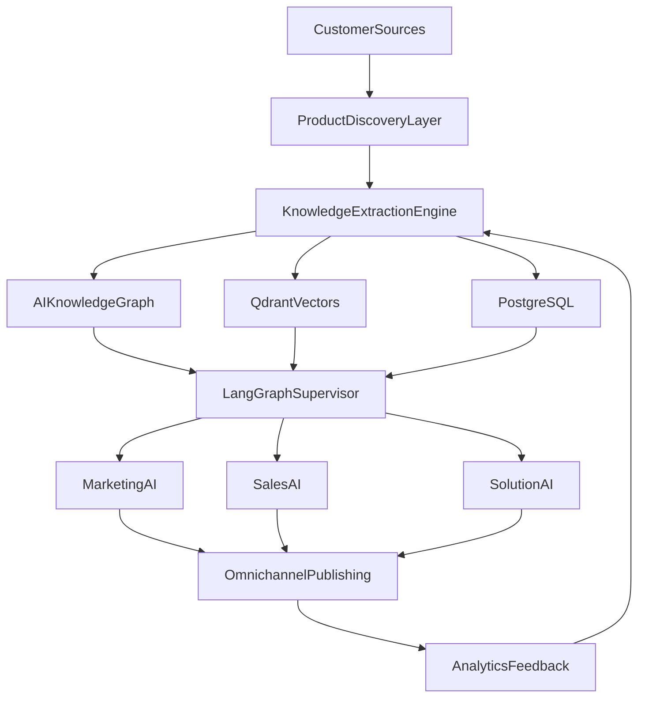

# Emissary — 12-Phase Implementation Guide

Multi-tenant SaaS platform where software companies onboard with a website or documentation URL. The platform builds a grounded knowledge base and runs AI marketing, sales, and solution agents.

**Status legend:** ✅ Complete · ⚠️ Partial / MVP · ❌ Stub / Not started

---

## Architecture overview



---

## Phase scorecard

| Phase | Name | Status | Primary code | API endpoints |
|-------|------|--------|--------------|---------------|
| 1 | Product Understanding Engine | ⚠️ MVP | `agents/product_understanding.py`, `services/ingestion.py` | `POST /products`, `/sources`, `/ingest`, `/understand`, `/query` |
| 2 | Marketing Intelligence | ⚠️ MVP | `agents/marketing_strategy.py` | `POST /products/{id}/strategy` |
| 3 | Content Studio + HITL | ⚠️ MVP | `agents/content_studio.py`, `services/citation_gate.py` | `POST /products/{id}/content`, `/artifacts/{id}/approve` |
| 4 | Sales Agent + Chat Widget | ⚠️ MVP | `agents/sales_agent.py`, `components/ChatWidget.tsx` | `POST /products/{id}/chat` |
| 5 | Personalized Outreach | ⚠️ MVP | `agents/outreach.py` | `POST /products/{id}/outreach` |
| 6 | Omnichannel Publishing | ❌ Stub | `services/publishing.py` | `POST /artifacts/{id}/publish` |
| 7 | Solution Architect | ⚠️ MVP | `agents/solution_architect.py` | `POST /products/{id}/architect` |
| 8 | Proposal Generator | ⚠️ MVP | `agents/proposal_generator.py` | `POST /products/{id}/proposals` |
| 9 | Analytics | ⚠️ MVP | `services/analytics.py` | `GET /products/{id}/analytics` |
| 10 | Continuous Learning | ⚠️ MVP | `services/learning.py`, `workers/` | `POST /products/{id}/refresh` |
| 11 | Multi-Agent Supervisor | ✅ Complete | `agents/supervisor.py`, `agents/executor.py`, `agents/registry.py`, `agents/tools.py` | `POST /products/{id}/supervisor` |
| 12 | Enterprise | ⚠️ MVP | `services/enterprise.py`, `auth.py` | `GET /audit`, RBAC on all routes |

---

## Phase 1 — AI Product Understanding Engine

**Goal:** Deep, searchable product intelligence from heterogeneous sources.

### Implemented ✅

- Multi-tenant FastAPI skeleton with JWT auth and RBAC
- SSRF-safe web crawler (`services/crawler.py`)
- Chunk → embed → Qdrant pipeline with tenant-scoped filters
- Neo4j knowledge graph with tenant isolation (`services/knowledge_graph.py`)
- LangGraph `ProductUnderstandingAgent` — profile + entity extraction
- APIs: create product, add sources, ingest, understand, query, get profile

### Gaps ⚠️

| Planned | Current |
|---------|---------|
| Playwright for JS-heavy sites | httpx + BeautifulSoup only |
| GitHub, PDF, DOCX, PPT, video, OpenAPI loaders | Enum exists; only WEBSITE/DOCS/BLOG ingested |
| Unstructured.io, Whisper, diagram OCR | Not implemented |

Background crawl via Redis queue is done: `services/job_queue.py::enqueue_source_ingest()` +
`routers/products.py::trigger_ingest()` enqueue the worker's `crawl_source` job when
`async_mode=True` and Redis workers are enabled; `POST /products/{id}/refresh` (Phase 10)
now enqueues `refresh_product_knowledge` the same way via `enqueue_product_refresh()`.

### Acceptance criteria

- [x] Tenant can onboard a product with a website URL
- [x] Crawl produces chunks in Qdrant with `tenant_id` filter
- [x] Product profile extracted and stored in Postgres
- [x] Grounded Q&A returns citations
- [ ] GitHub/PDF/video sources ingest successfully
- [x] Ingest runs asynchronously via worker queue

### Tests

| Test | File | Status |
|------|------|--------|
| Chunk text splitting | `tests/test_api.py::TestChunking` | ✅ |
| Citation grounding | `tests/test_api.py::TestCitationGate` | ✅ |
| Crawler SSRF block | `tests/test_crawler.py::TestValidateUrl` | ✅ |
| Ingest end-to-end | `tests/test_ingestion.py::test_ingest_pipeline` | ✅ |
| Tenant isolation (Qdrant) | `tests/test_vector_store.py::test_tenant_isolation_qdrant` | ✅ |

---

## Phase 2 — Marketing Intelligence Agent

**Goal:** GTM strategy artifacts grounded on product KB.

### Implemented ✅

- `MarketingStrategyAgent` LangGraph workflow
- Outputs: GTM strategy, ICP, personas, positioning, messaging, SEO keywords, content calendar
- Artifacts versioned in Postgres

### Gaps ⚠️

- Citations returned empty from API
- No strategy workspace UI (edit / lock as brand context)
- No competitive intel from external sources

### Acceptance criteria

- [x] Generate strategy from ingested product KB
- [x] Store as versioned artifact
- [ ] Strategy editable and lockable as brand context
- [ ] Citations populated from KB chunks

### Tests

| Test | Status |
|------|--------|
| Strategy agent (mocked LLM) | ❌ Missing |
| Artifact persistence | ❌ Missing |

---

## Phase 3 — AI Content Studio

**Goal:** Grounded content generation with human-in-the-loop approval.

### Implemented ✅

- `ContentStudioAgent` with RAG + citation gate
- Content types: LinkedIn, blog, email, X thread (via `content_type` param)
- Approval workflow: `POST /artifacts/{id}/approve`
- Publish blocked until approved

### Gaps ⚠️

- No multi-language or SEO scoring
- No dedicated content review UI
- Tone/persona params exist but UI uses defaults

### Acceptance criteria

- [x] Generate grounded content draft
- [x] Citation gate blocks ungrounded claims
- [x] Approval required before publish
- [ ] Multi-language generation
- [ ] SEO scoring

### Tests

| Test | Status |
|------|--------|
| Citation gate | ✅ `TestCitationGate` |
| Content generation (mocked LLM) | ❌ Missing |
| Approval → publish gate | ❌ Missing |

---

## Phase 4 — AI Sales Agent

**Goal:** Conversational RAG sales assistant with embeddable widget.

### Implemented ✅

- `SalesAgent` LangGraph with grounded RAG, lead scoring, conversation history
- `POST /products/{id}/chat` API
- Embeddable `ChatWidget.tsx` component
- Frontend chat tab in product workspace

### Gaps ⚠️

- No WebSocket/SSE streaming
- ChatWidget not auto-mounted on product page (use tab or embed manually)
- BANT lead qualification not tested

### Acceptance criteria

- [x] Chat returns grounded answers with citations
- [x] Conversation persisted per session
- [x] Embeddable widget component exists
- [ ] Streaming responses
- [ ] Lead qualification scoring validated

### Tests

| Test | Status |
|------|--------|
| Sales chat (mocked LLM) | ❌ Missing |
| Lead score computation | ❌ Missing |

### Widget embed

```tsx
import ChatWidget from '@/components/ChatWidget';

<ChatWidget productId="your-product-uuid" apiUrl="/api" />
```

---

## Phase 5 — Personalized Outreach Engine

**Goal:** Research prospect → pain detection → personalized email drafts.

### Implemented ✅

- `OutreachAgent` LangGraph workflow
- Company analysis, pain points, product fit, email draft, follow-up sequence
- Draft-only (requires approval before send)

### Gaps ⚠️

- No LinkedIn/public signal research
- No campaign management
- Prospect dossier depth limited to LLM + company URL crawl

### Acceptance criteria

- [x] Generate outreach draft from company URL
- [x] Follow-up sequence included
- [ ] LinkedIn / public signal enrichment
- [ ] Campaign tracking

### Tests

| Test | Status |
|------|--------|
| Outreach agent (mocked LLM) | ❌ Missing |

---

## Phase 6 — Omnichannel Publishing

**Goal:** Publish approved content to LinkedIn, X, Medium, blog CMS, email, etc.

### Implemented ⚠️

- Approval gate before publish
- Idempotency keys on `ChannelPost`
- **Pluggable adapter interface** (`services/publishing_adapters/`, `PublishAdapter` protocol) —
  `publish_artifact()` dispatches to a per-channel adapter instead of a hardcoded mock
- **Real `email`/`newsletter` channel** via SMTP (`email_adapter.py`, configured with
  `SMTP_HOST`/`SMTP_USER`/`SMTP_PASSWORD`; degrades to `not_configured` when unset)

### Gaps ❌

- LinkedIn/X/Medium/Dev.to/Reddit/blog remain stub adapters (`stub_adapter.py`) — need real
  OAuth app registration + credentials per channel, which is an operator action, not just code
- No scheduler or retry queue for `scheduled_at` posts
- No A/B variants or engagement prediction
- No publishing dashboard UI

### Acceptance criteria

- [x] Publish blocked without approval
- [x] Idempotent publish records
- [x] Pluggable adapter interface (`PublishAdapter` protocol)
- [x] One real (non-OAuth) channel connector (email via SMTP)
- [ ] Real LinkedIn/X/Medium connectors
- [ ] Scheduled publish via worker
- [ ] Failed publish retry

### Tests

| Test | File | Status |
|------|------|--------|
| Approval gate blocks publish | `tests/test_publishing.py::test_publish_blocked_without_approval` | ✅ |
| Idempotency dedup | `tests/test_publishing.py::test_publish_rejects_duplicate_idempotency_key` | ✅ |
| Email adapter degrades without SMTP config | `tests/test_publishing.py::test_publish_email_channel_real_adapter_not_configured_without_smtp` | ✅ |

---

## Phase 7 — AI Solution Architect

**Goal:** Technical pre-sales assistant with architecture diagrams and deployment plans.

### Implemented ✅

- `SolutionArchitectAgent` with RAG + citation gate
- Mermaid architecture diagrams in response
- Deployment plan and security notes
- Frontend Architect tab in product workspace

### Gaps ⚠️

- No diagram export (PNG/PDF)
- No cost estimation module

### Acceptance criteria

- [x] Answer technical pre-sales questions with citations
- [x] Return Mermaid diagram when applicable
- [ ] Export diagram as image/PDF

### Tests

| Test | Status |
|------|--------|
| Architect agent (mocked LLM) | ❌ Missing |

---

## Phase 8 — AI Proposal Generator

**Goal:** One-click proposal packs with PDF/DOCX/PPTX export.

### Implemented ✅

- `ProposalGeneratorAgent` — proposal, SOW, ROI, pricing, timeline
- Artifacts stored in Postgres
- Frontend Proposal tab in product workspace
- **PDF/DOCX/PPTX export** — `services/proposal_export.py` (weasyprint / python-docx /
  python-pptx), `GET /products/{id}/proposals/{artifact_id}/export?format=pdf|docx|pptx`,
  with Export buttons in the Forge Proposal tab

### Gaps ⚠️

- No dedicated export test (renderers are exercised manually/smoke-tested, not unit-tested)

### Acceptance criteria

- [x] Generate proposal JSON artifact from scope + KB
- [x] Export PDF
- [x] Export DOCX
- [x] Export PPTX

### Tests

| Test | Status |
|------|--------|
| Proposal agent (mocked LLM) | ❌ Missing |
| PDF/DOCX/PPTX export | ⚠️ Manually verified, no automated test yet |

---

## Phase 9 — AI Analytics

**Goal:** Funnel metrics, engagement, knowledge gaps.

### Implemented ✅

- `MetricEvent` emission on queries (including ungrounded blocks)
- Funnel: visitors → content views → conversations → leads → artifacts → agent runs
- Top questions and knowledge gap feeds
- Analytics tab in product workspace

### Gaps ⚠️

- No meetings/closed-deals tracking
- No email open/CTR metrics
- Events depend on consistent emission across agents

### Acceptance criteria

- [x] Analytics API returns funnel + knowledge gaps
- [x] Ungrounded queries tracked as gaps
- [ ] Full sales funnel (meetings → proposals → closed)
- [ ] Email engagement metrics

### Tests

| Test | Status |
|------|--------|
| Analytics aggregation | ❌ Missing |
| Event emission | ❌ Missing |

---

## Phase 10 — Continuous Learning Engine

**Goal:** Monitor source changes, re-embed, refresh stale assets.

### Implemented ⚠️

- Source change detection via content hash
- `refresh_product` re-ingests changed sources
- Worker job `refresh_product_knowledge`
- `POST /products/{id}/refresh` API — now enqueues to the worker (`async_mode=True` by
  default, via `enqueue_product_refresh()`) instead of running synchronously in-request;
  falls back to sync when Redis workers are disabled

### Gaps ⚠️

- No scheduled cron / drift alerts
- Stale artifacts counted but not auto-regenerated
- No GitHub/release-notes monitoring

### Acceptance criteria

- [x] Detect changed source URLs and re-ingest
- [x] Worker can run refresh job
- [ ] Scheduled refresh per product
- [ ] Auto-regenerate stale marketing assets as drafts

### Tests

| Test | Status |
|------|--------|
| Source change detection | ❌ Missing |
| Refresh re-ingest | ❌ Missing |

---

## Phase 11 — Multi-Agent Supervisor

**Goal:** Single orchestration runtime routing to all agent subgraphs.

### Implemented ✅

- LangGraph supervisor with request-type → agent routing table (`agents/registry.py`)
- `agents/executor.py::dispatch_agent()` resolves the routed agent and calls one of 11 real
  `_execute_*` handlers (product, market_research, lead_discovery, lead_qualification,
  outreach, campaign, sales_engineer, proposal, analytics, crm, customer_success) — each
  invoking the real agent/service functions, persisting `Artifact`/`AgentRun` rows, and
  recording usage
- `AgentInput.upstream_artifacts` is now populated: `dispatch_agent()` resolves
  `upstream_artifact_ids`/`upstream_agent_run_id` from the request payload into looked-up
  `Artifact`/`AgentRun` rows, so a dispatch can chain off a prior agent's output
- Minimal tool registry (`agents/tools.py`): `search_kb`, `create_artifact`, `schedule_post`,
  callable by agent code without duplicating RAG-search/persistence/publish logic
- `POST /products/{id}/supervisor` endpoint (`routers/agents.py`) calls `run_supervisor`

### Note

Multi-step orchestration exists via two mechanisms today: this per-request dispatch (single
agent per call, optionally chained via `upstream_artifacts`) and the separate `WorkflowRun`
mechanism (`services/workflows.py`) that already sequences `outbound_sprint`/`technical_eval`
across multiple agents with `202`-accepted + poll semantics. They're not unified into one
orchestrator — that's an intentional scope boundary, not a gap being tracked.

### Acceptance criteria

- [x] Routing table maps request types to agents
- [x] Supervisor dispatches to real agent implementations
- [x] Shared memory across agent calls (`upstream_artifacts`)
- [x] Tool registry (search_kb, create_artifact, schedule_post)

### Tests

| Test | File | Status |
|------|------|--------|
| Route mapping | `tests/test_agent_registry.py::TestAgentRegistry` | ✅ |
| End-to-end dispatch (mocked LLM) | `tests/test_agent_registry.py::TestSupervisorExecution::test_run_supervisor_strategy_mocked` | ✅ |

---

## Phase 12 — Enterprise Features

**Goal:** SSO, RBAC, audit, compliance, private deploy.

### Implemented ⚠️

- JWT auth with bcrypt
- RBAC roles: admin, editor, approver, viewer
- Audit logs on key actions
- Plan tiers: starter / growth / enterprise with product limits
- Suppression list, tenant purge, data export

### Gaps ❌

- No SSO (Auth0/Keycloak) — `sso: true` is a plan flag only
- No public API keys
- No private/VPC deploy tooling
- No SOC2/GDPR compliance modules

### Acceptance criteria

- [x] RBAC enforced on write/approve/publish routes
- [x] Immutable audit trail queryable via `GET /audit`
- [x] Product limits per plan tier
- [ ] SSO integration
- [ ] API key authentication
- [ ] Private deployment guide

### Tests

| Test | Status |
|------|--------|
| Plan feature flags | ✅ `TestEnterprise::test_plan_features` |
| RBAC enforcement | ❌ Missing |
| Audit log creation | ❌ Missing |

---

## Cross-cutting: LLM providers

Dual-provider layer (Ollama + OpenAI) documented in [ollama-llm-integration.md](./ollama-llm-integration.md).

- Default dev: Ollama (free, local)
- Production: OpenAI (GPT-4o / GPT-4o-mini)
- Per-agent model routing via env vars
- 15 tests (6 unit + 9 integration) in `tests/test_api.py` and `tests/test_llm_integration.py`

---

## Test matrix summary

145 tests across `apps/api/tests/` (per-file breakdown grew organically with each wave —
see individual phase sections above for the tests most relevant to that phase, or run
`pytest --collect-only -q` for the full list). All passing as of this update.

### Previously "recommended next tests" — now implemented

1. `test_crawler_blocks_private_ips` — SSRF validation — ✅ `tests/test_crawler.py`
2. `test_ingest_pipeline` — crawl → chunk → embed (mocked externals) — ✅ `tests/test_ingestion.py`
3. `test_approval_blocks_publish` — Phase 3 + 6 gate — ✅ `tests/test_publishing.py`
4. `test_tenant_isolation_qdrant` — cross-tenant search never leaks — ✅ `tests/test_vector_store.py` (real in-memory Qdrant, not mocked)
5. `test_supervisor_dispatches_strategy` — Phase 11 wiring — ✅ `tests/test_agent_registry.py`
6. `test_api_products_crud` — ✅ `tests/test_api_products.py` (direct router-function calls with
   mocked `AsyncSession`, matching this suite's established convention, not a TestClient+
   dependency-override HTTP harness)

Run all tests:

```bash
make test
# or
cd apps/api && python -m pytest tests/ -v
```

---

## Frontend workspace

Product workspace tabs (`apps/web/src/app/products/[id]/page.tsx`):

| Tab | Phase | API |
|-----|-------|-----|
| Overview | 1 | ingest, understand, profile |
| Q&A | 1 | query |
| Strategy | 2 | strategy |
| Content | 3 | content |
| Sales Chat | 4 | chat |
| Outreach | 5 | outreach |
| Architect | 7 | architect |
| Proposal | 8 | proposals, `GET .../proposals/{id}/export?format=pdf\|docx\|pptx` |
| Analytics | 9 | analytics |

API client: `apps/web/src/lib/api.ts`

---

## Roadmap priorities

`Wire supervisor to real agents`, `Wire ingest to background workers`, `PDF/DOCX proposal
export`, and `Real publishing adapter interface` (below) are now done — see Phases 11, 1, 10,
8, and 6 above for what's implemented vs. still open on each.

| Priority | Item | Phases |
|----------|------|--------|
| P1 | Real LinkedIn/X/Medium/Dev.to/Reddit connectors (adapters are stubbed behind a pluggable interface — needs OAuth app credentials) | 6 |
| P2 | GitHub/PDF source loaders | 1 |
| P2 | SSO (Auth0/Keycloak) | 12 |
| P2 | WebSocket chat streaming (replace polling for chat/ingest/workflow progress) | 4 |
| P3 | Playwright crawler | 1 |
| P3 | Scheduled learning cron (refresh runs async now, but isn't scheduled) | 10 |
| P3 | Publish scheduler + retry queue for `scheduled_at` posts | 6 |

---

## Quick reference

```bash
make start    # infra + DB + API + web (background) — local dev, bare processes
make stop     # stop processes + Docker
make test     # 145 tests
curl http://localhost:8000/health
```

Containerized (api/web/workers as Docker images alongside the existing backing-infra
compose file — see [Dockerfiles + compose overlay](../docker-compose.prod.yml)):

```bash
cp .env.prod.example .env   # then edit secrets
docker compose --project-directory . -f infra/docker-compose.yml -f docker-compose.prod.yml up -d --build
```

Full local dev guide (setup, scripts, Makefile, troubleshooting): [dev-guide.md](./dev-guide.md)
