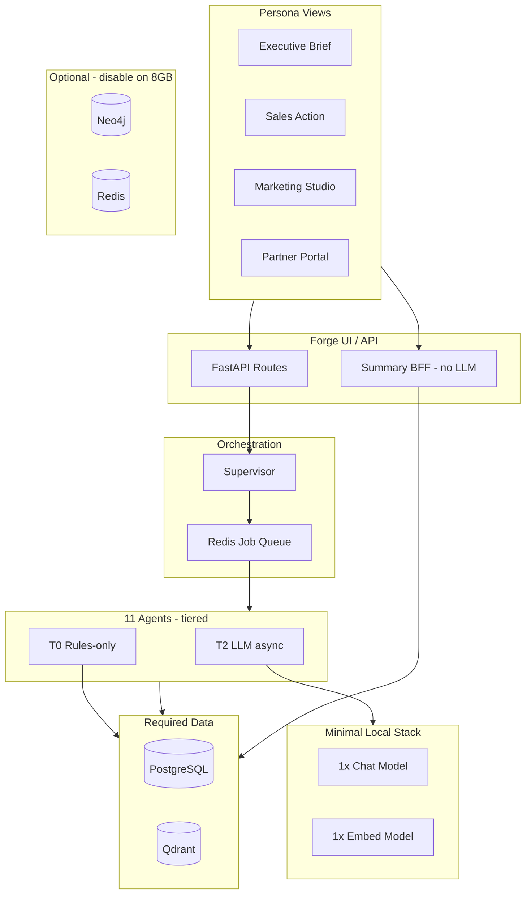
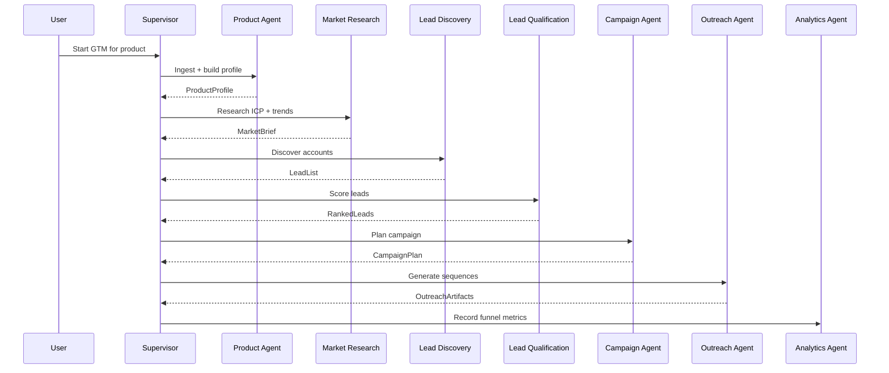
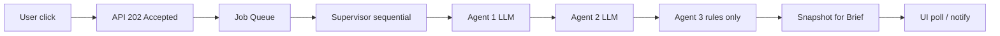

# Multi-Agent Composition Plan — Emissary

Plan to evolve from **7 monolithic LangGraph agents + routing stub** into **11 specialized, composable agents** orchestrated by a real supervisor.

**Design constraint:** Must run on **minimum hardware** for a **small core team** — executives, board members, sales reps, marketing, and sales partners — not a GPU farm or dedicated ML ops team.

**Status:** Wave 0 ✅ · Wave 1 ✅ · Wave 2 ✅ · Wave 3 ✅ · Wave 4 ✅ (CS + insights + workers)  
**Last updated:** 2026-08-04

---

## 0. Lean GTM principles (hardware-first)

| Principle | What it means |
|-----------|----------------|
| **Agents are logic, not GPUs** | Most agents use rules + SQL + cached artifacts; LLM only where language quality matters |
| **Two local models max** | One chat model + one embedding model on Ollama (~8–10 GB RAM total) |
| **Async by default for heavy work** | Ingest, discovery, proposals run in background; UI shows progress + notifications |
| **Read cached, write once** | Product profile, market brief, and strategy are computed once and reused by all agents |
| **Persona-specific depth** | Executives get summaries; operators get full artifacts — same backend, different views |
| **Cloud burst optional** | OpenAI/API for premium quality when local hardware is tight (`LLM_TIER=cloud`) |
| **No agent runs at click-time for dashboards** | Analytics Agent uses SQL aggregates; LLM narrative is optional / scheduled |

**Target hardware (local / small team):**

| Profile | RAM | CPU | What runs |
|---------|-----|-----|-----------|
| **Minimum** | 8 GB | 4-core Apple Silicon / x86 | API + Postgres + Qdrant + **1× chat 3B/8B** + embed; workers off |
| **Recommended** | 16 GB | 8-core | Above + Redis worker + **llama3.1:8b** + **nomic-embed-text** |
| **Comfortable** | 32 GB | 8-core+ | Optional second model for proposals only |

**Not required for MVP:** Neo4j (optional), GPU, multiple 14B+ models loaded simultaneously, always-on reasoning models.

---

## 1. Why specialized agents (not one large agent)

| Problem with one agent | Benefit of composition |
|------------------------|-------------------------|
| Context window fills with unrelated skills | Each agent gets a narrow prompt + tools |
| Hard to tune model per task (chat vs proposal vs research) | Per-agent model routing — or **one shared model** in lean mode |
| Failures are opaque | Clear ownership per step in pipeline |
| Cannot parallelize safely on 16 GB laptops | Supervisor runs **sequential** LLM steps; parallel only in cloud/full profile |
| Difficult to test | Each agent has contract + unit tests |

**Principle:** Agents are **single-responsibility workers**. The **Supervisor** routes, sequences, and aggregates. **Shared services** (RAG, citations, CRM records) are not agents.

### 1.1 User personas & what they need (not what they run)

| Persona | Primary goals | UI mode | Compute profile |
|---------|---------------|---------|-----------------|
| **Executive / Board** | Pipeline snapshot, GTM progress, risks, ROI narrative | **Brief** — 1-page dashboard, no agent buttons | Tier 0–1 (SQL + cached summaries) |
| **Sales person** | Qualified leads, talk tracks, next actions, proposals | **Action** — lists, chat, one-click outreach | Tier 1–2 (light LLM on demand) |
| **Marketing** | ICP, campaigns, content calendar, performance | **Studio** — strategy + campaign tabs | Tier 2 async (batch jobs) |
| **Sales partner** | Product facts, co-branded outreach, deal reg | **Partner** — read-only profile + templated outreach | Tier 1 (templates, minimal LLM) |
| **Admin / RevOps** | Ingest, config, approvals, audit | **Ops** — full workflow controls | Tier 2–3 (background jobs) |

**Rule:** Executives never wait on a 10-minute LLM job. They read **pre-materialized briefs** refreshed by workers or on schedule.

---

## 2. Target agent catalog

| # | Agent | Responsibility | Maps to today | Maturity | **Compute tier** |
|---|-------|----------------|---------------|----------|------------------|
| 1 | **Product Agent** | Understand Zyvor products, capabilities, docs, profile | `product_understanding.py` + ingest/RAG | ⚠️ MVP (~60%) | **T2 async** / **T1 read** |
| 2 | **Market Research Agent** | Target industries, trends, TAM, competitor landscape | Partially in `marketing_strategy.py` | ❌ New | **T2 async** |
| 3 | **Lead Discovery Agent** | Find companies + decision-makers | Not built | ❌ New | **T1 rules** + optional T2 batch |
| 4 | **Lead Qualification Agent** | Score, prioritize, BANT/MEDDIC-style fit | Partial in `sales_agent.py` | ❌ New | **T0 rules** + T2 optional explain |
| 5 | **Outreach Agent** | Personalized email/LinkedIn sequences | `outreach.py` | ⚠️ MVP (~50%) | **T2** on-demand |
| 6 | **Campaign Agent** | Create, schedule, monitor multi-step campaigns | `Campaign` model exists | ❌ New | **T0 schedule** + T1 templates |
| 7 | **Sales Engineer Agent** | Technical Q&A, demos, architecture | `solution_architect.py` + `sales_agent.py` | ⚠️ MVP (~55%) | **T2** on-demand |
| 8 | **Proposal Agent** | Proposals, SOW, ROI | `proposal_generator.py` | ⚠️ MVP (~50%) | **T2 async** |
| 9 | **CRM Agent** | Opportunities, stages, follow-ups | `Lead`, `Conversation` models | ❌ New | **T0** (CRUD/rules) |
| 10 | **Customer Success Agent** | Adoption, health, renewals | Not built | ❌ New | **T1** scheduled briefs |
| 11 | **Analytics Agent** | Pipeline, marketing, sales KPIs | `analytics.py` | ⚠️ MVP (~40%) | **T0 SQL** + T1 optional narrative |

**Compute tiers:**

| Tier | Name | Uses LLM? | Latency target | Examples |
|------|------|-----------|----------------|----------|
| **T0** | Deterministic | No | < 100 ms | CRM stage updates, funnel counts, lead rules |
| **T1** | Cached / template | Rarely | < 1 s | Executive dashboard, partner templates, qualification scores |
| **T2** | Light LLM | Yes (small model) | 30 s – 5 min async | Outreach, architect Q&A, profile build |
| **T3** | Cloud burst | Yes (GPT-4o) | On demand | Board-ready proposal polish, complex research |

**Rename mapping (internal IDs):**

```
product          → Product Agent
market_research  → Market Research Agent   (new)
lead_discovery   → Lead Discovery Agent    (new)
lead_qualification → Lead Qualification Agent (new)
outreach         → Outreach Agent
campaign         → Campaign Agent          (new)
sales_engineer   → Sales Engineer Agent    (split from solution + sales)
proposal         → Proposal Agent
crm              → CRM Agent               (new)
customer_success → Customer Success Agent  (new)
analytics        → Analytics Agent
```

Content generation (`content_studio.py`) stays as a **tool** invoked by Campaign / Market Research agents, not a top-level GTM agent in your table.

---

## 3. Architecture

### 3.1 Layered design (lean deployment)



### 3.1b Minimal vs full stack

| Component | Minimal (8–16 GB) | Full |
|-----------|-------------------|------|
| PostgreSQL | ✅ Required | ✅ |
| Qdrant | ✅ Required | ✅ |
| Ollama | ✅ 2 models | ✅ |
| Redis + workers | ⚠️ Optional (sync fallback) | ✅ |
| Neo4j knowledge graph | ❌ Skip — use Qdrant + JSON profile | ✅ |
| MinIO | ❌ Store artifacts in Postgres JSONB | ✅ |
| OpenAI | Optional burst | ✅ Production |

### 3.2 Supervisor responsibilities (replace stub in `supervisor.py`)

Today `execute_*` nodes only return `{"status": "routed"}`. Target behavior:

1. **Classify intent** — map user/API request → workflow (e.g. `full_gtm`, `outbound_sprint`, `technical_eval`)
2. **Resolve dependencies** — Product Agent must run before Market Research if profile empty
3. **Dispatch** — call specialized agent graph or **enqueue worker job** (heavy steps)
4. **Hand off state** — pass structured artifacts (profile, ICP, lead list, scores)
5. **Human gates** — pause at HITL approval (content, outreach, proposal)
6. **Emit events** — `MetricEvent` for Analytics Agent
7. **Materialize briefs** — write executive summaries to `artifacts` / `dashboard_snapshots` (no LLM at read time)

### 3.2b Job queue contract (resource-aware)

Heavy workflows **never block HTTP** on 16 GB laptops:

```json
POST /workflows/outbound_sprint → 202 Accepted
{
  "workflow_run_id": "uuid",
  "status": "queued",
  "poll_url": "/workflows/runs/uuid"
}
```

| Step | Execution | User sees |
|------|-----------|-------------|
| Ingest + profile | Background worker | Progress bar on Overview |
| Market research | Background | Notification when brief ready |
| Lead discovery | Background batch | Leads tab populates |
| Qualification | Inline rules + async LLM explain | Instant sort + optional “why” |
| Outreach | On-demand LLM | Spinner on Outreach tab |
| Executive dashboard | Read snapshot | Instant load |

---

Each agent module follows the same shape:

```
agents/
  base.py              # AgentState protocol, invoke_* pattern, LLM error wrap
  product_agent.py     # rename from product_understanding.py
  market_research_agent.py
  ...
  registry.py          # agent_id → graph builder, model key, required inputs
```

**Standard interface:**

```python
@dataclass
class AgentInput:
    tenant_id: UUID
    product_id: UUID
    user_id: UUID
    payload: dict          # agent-specific
    upstream_artifacts: dict  # outputs from prior agents

@dataclass
class AgentOutput:
    agent_id: str
    status: Literal["completed", "failed", "needs_input"]
    artifacts: dict        # persisted or returned
    citations: list[Citation]
    tokens_used: int
    next_suggested_agents: list[str]
```

**Rules:**

- Agents **never** hold DB sessions during LLM calls (pattern from `marketing.py` / `architect` fix)
- All factual claims go through **citation gate** when using RAG
- Prompt templates use `{{escaped}}` braces for JSON examples

---

## 4. End-to-end GTM workflows (composition)

### Workflow A — Full GTM launch (Zyvor onboarding)



### Workflow B — Technical evaluation (pre-sales)

```
Product Agent (context) → Sales Engineer Agent → Proposal Agent → CRM Agent (create opp)
```

### Workflow C — Customer lifecycle (post-sale)

```
CRM Agent (account context) → Customer Success Agent → Analytics Agent
```

### 4.1 Lean execution rules (all workflows)



| Rule | Lean behavior |
|------|---------------|
| HTTP | Return **202** for any workflow > 5 s |
| LLM concurrency | **1** active inference per machine |
| Caching | Reuse profile / strategy if input hash unchanged |
| Exec read path | Brief reads **snapshots only** |
| Partner path | Templates + product profile; LLM only for “personalize” button |

---

## 5. Per-agent specification

### 5.1 Product Agent ✅ extend

| Item | Detail |
|------|--------|
| **Inputs** | URLs, docs, repos, PDFs |
| **Outputs** | `ProductProfile`, entities → Neo4j, chunks → Qdrant |
| **Tools** | crawler, chunker, embedder, citation gate |
| **Model** | `qwen2.5-coder:14b` or `llama3.1:8b` (env) |
| **API** | Existing: `/ingest`, `/understand`, `/profile` |
| **Gap** | PDF/GitHub/video ingest; workers enqueue |

### 5.2 Market Research Agent 🆕

| Item | Detail |
|------|--------|
| **Inputs** | Product profile, optional industry focus |
| **Outputs** | `MarketBrief`: industries, trends, competitors, TAM signals, SEO themes |
| **Tools** | RAG over product docs + optional web search (future) |
| **Model** | `deepseek-r1:8b` or `gpt-4o` for reasoning |
| **API** | `POST /products/{id}/market-research` |
| **Reuse** | Split strategy logic from `marketing_strategy.py` |

### 5.3 Lead Discovery Agent 🆕

| Item | Detail |
|------|--------|
| **Inputs** | ICP from Market Research, geo, company size filters |
| **Outputs** | `LeadList`: company, domain, personas, LinkedIn hints |
| **Tools** | Crawler (prospect sites), enrichment API (Clearbit/Apollo — future) |
| **Model** | `llama3.1:8b` |
| **API** | `POST /products/{id}/discover-leads` |
| **Data** | New table `discovered_accounts` or extend `Lead` |

### 5.4 Lead Qualification Agent 🆕

| Item | Detail |
|------|--------|
| **Inputs** | Lead list, product profile, conversation history |
| **Outputs** | Scored leads (0–100), tier (A/B/C), recommended next action |
| **Tools** | Rules engine + LLM scoring; read `Conversation`, `Lead` |
| **Model** | `llama3.1:8b` |
| **API** | `POST /products/{id}/qualify-leads` |
| **Reuse** | Extend `sales_agent.lead_score` logic |

### 5.5 Outreach Agent ✅ extend

| Item | Detail |
|------|--------|
| **Inputs** | Qualified lead, persona, campaign context |
| **Outputs** | Email + follow-up sequence artifact |
| **API** | Existing `/outreach` |
| **Gap** | LinkedIn variant; A/B variants; approval gate |

### 5.6 Campaign Agent 🆕

| Item | Detail |
|------|--------|
| **Inputs** | Strategy, content calendar, lead segments |
| **Outputs** | `Campaign` record, schedule, channel mix, KPI targets |
| **Tools** | Content Studio for assets; Redis/worker for scheduling |
| **Model** | `llama3.1:8b` |
| **API** | `POST /products/{id}/campaigns`, `GET /campaigns/{id}/status` |
| **Gap** | Wire `Campaign` model; monitoring loop in workers |

### 5.7 Sales Engineer Agent ✅ refactor

| Item | Detail |
|------|--------|
| **Inputs** | Technical question, product profile, RAG context |
| **Outputs** | Answer, Mermaid diagram, demo script, deployment plan |
| **Merge** | `solution_architect.py` + technical mode of `sales_agent.py` |
| **API** | Existing `/architect`, `/chat` (technical intent routing) |

### 5.8 Proposal Agent ✅ extend

| Item | Detail |
|------|--------|
| **Inputs** | Scope, opportunity context from CRM |
| **Outputs** | Proposal, SOW, ROI, pricing (grounded) |
| **API** | Existing `/proposals` |

### 5.9 CRM Agent 🆕

| Item | Detail |
|------|--------|
| **Inputs** | Leads, chats, artifacts, manual updates |
| **Outputs** | Opportunity stages, tasks, follow-up reminders |
| **Tools** | CRUD on `Lead`, `Conversation`; optional HubSpot/Salesforce sync |
| **Model** | `llama3.1:8b` for next-action suggestions |
| **API** | `GET/POST /opportunities`, `POST /opportunities/{id}/next-action` |

### 5.10 Customer Success Agent 🆕

| Item | Detail |
|------|--------|
| **Inputs** | Account usage signals, support docs, renewal date |
| **Outputs** | Health score, adoption playbook, renewal risk, QBR brief |
| **Tools** | RAG + product profile |
| **API** | `POST /accounts/{id}/success-plan` |
| **Phase** | Wave 4 (needs CRM Agent first) |

### 5.11 Analytics Agent ✅ extend

| Item | Detail |
|------|--------|
| **Inputs** | MetricEvents, artifacts, campaigns, opportunities |
| **Outputs** | Dashboards: funnel, pipeline, content performance, agent usage |
| **Tools** | SQL aggregations + LLM narrative insights |
| **API** | Existing `/analytics` + `GET /insights` |
| **Gap** | LLM-generated recommendations; pipeline metrics |

---

## 6. Implementation phases (lean-first)

Phases are ordered so **executives and sales get value before heavy pipeline agents**. Each wave ships a usable slice on 16 GB hardware.

### Wave 0 — Lean runtime (1 week, parallel with Wave 1)

**Goal:** Platform runs reliably on minimum hardware before adding agents.

| Task | Deliverable |
|------|-------------|
| `LLM_PROFILE=lean` in config | All agents default to **one chat model** (`llama3.1:8b`) |
| `DEPLOYMENT_PROFILE=minimal` | Neo4j/MinIO/Redis optional via env flags |
| Worker queue for ingest + strategy | `202 Accepted` + poll; no browser timeout |
| `dashboard_snapshots` table | Pre-computed executive brief (SQL + optional nightly LLM) |
| Role-based Forge routes | `/brief` (exec), `/sales`, `/marketing`, `/partner` shells |
| `.env.lean.example` | Copy-paste preset for 8–16 GB Mac |

**Exit criteria:** Executive opens Forge → dashboard loads in < 2 s with zero LLM calls.

### Wave 1 — Foundation (2–3 weeks)

**Goal:** Real supervisor + agent registry; no new agents yet.

| Task | Deliverable |
|------|-------------|
| Create `agents/registry.py` | Metadata includes `compute_tier`, `async_required` |
| Create `agents/base.py` | `AgentInput`/`AgentOutput`, `invoke_*` pattern, LLM errors |
| Wire supervisor to real agents | Replace stub `execute_*` with calls to existing graphs |
| Extend `config.py` | Model keys + **`LLM_SINGLE_MODEL`** override for lean mode |
| DB session pattern | All long-running agents release DB before LLM |
| Sequential agent dispatch | **No parallel LLM** in supervisor (one model in RAM) |
| Tests | Supervisor integration test with mocked LLM |

**Exit criteria:** `POST /supervisor` with `request_type=strategy` runs `marketing_strategy` and returns artifact without holding DB session.

### Wave 2 — Pipeline agents (3–4 weeks)

**Goal:** Sales + marketing pipeline; discovery/qualification mostly **T0/T1**.

| Task | Agent | Lean note |
|------|-------|-----------|
| Split market research from strategy | Market Research | Async job only |
| Rule-based discovery + CSV import | Lead Discovery | LLM optional for enrichment |
| Rules-first scoring + optional “explain score” | Lead Qualification | Instant sort without LLM |
| Campaign CRUD + templates | Campaign Agent | No LLM for schedule |
| Supervisor `outbound_sprint` | Orchestrator | **Sequential** MR → LD → LQ → OR |

**Exit criteria:** Sales clicks **Run Outbound Sprint** → gets 202 + progress; leads tab updates without blocking UI.

### Wave 3 — Revenue agents (2–3 weeks)

| Task | Agent | Lean note |
|------|-------|-----------|
| Merge architect + technical chat | Sales Engineer | On-demand only |
| CRM opportunity model (T0) | CRM Agent | No LLM for stage moves |
| Proposal async job | Proposal Agent | Queue + email/notify when done |
| Workflow `technical_eval` | Product → SE → Proposal → CRM | Partner can view read-only |

### Wave 4 — Success & intelligence (2–3 weeks)

| Task | Agent | Lean note |
|------|-------|-----------|
| Scheduled CS briefs | Customer Success | Cron/worker, not live |
| SQL-first analytics + weekly narrative | Analytics Agent | LLM insight max 1×/week |
| Campaign monitor worker | Campaign Agent | Background only |
| External CRM sync (optional) | CRM Agent | Off by default in minimal profile |

**Deferred until hardware allows:** Neo4j graph, parallel agent branches, multiple loaded models, always-on `deepseek-r1`.

---

## 7. Data model extensions

| Entity | Purpose | Wave |
|--------|---------|------|
| `discovered_accounts` | Raw lead discovery results | 2 |
| `lead_scores` | Qualification history | 2 |
| `opportunities` | CRM pipeline stages | 3 |
| `opportunity_activities` | Tasks, calls, emails | 3 |
| `account_health` | CS metrics | 4 |
| `agent_runs` (exists) | Link each run to agent_id + workflow_id | 1 |
| `workflow_runs` | Supervisor execution trace | 1 |
| **`dashboard_snapshots`** | Executive brief JSON — **no LLM at read** | 0 |
| **`artifact_cache`** | Hash of inputs → skip re-running LLM | 1 |

---

## 8. API surface (target)

| Endpoint | Agent(s) |
|----------|----------|
| `POST /products/{id}/workflows/{name}` | Supervisor (multi-agent) |
| `POST /products/{id}/understand` | Product |
| `POST /products/{id}/market-research` | Market Research |
| `POST /products/{id}/discover-leads` | Lead Discovery |
| `POST /products/{id}/qualify-leads` | Lead Qualification |
| `POST /products/{id}/outreach` | Outreach |
| `POST /products/{id}/campaigns` | Campaign |
| `POST /products/{id}/architect` | Sales Engineer |
| `POST /products/{id}/proposals` | Proposal |
| `GET/POST /products/{id}/opportunities` | CRM |
| `POST /accounts/{id}/success-plan` | Customer Success |
| `GET /products/{id}/analytics` | Analytics |

| `GET /products/{id}/brief` | Analytics + cached snapshots (**exec, T0**) |
| `GET /workflows/runs/{id}` | Poll async workflow status |

**Unified workflow example (async):**

```json
POST /api/v1/products/{id}/workflows/outbound_sprint
→ 202 Accepted
{
  "workflow_run_id": "uuid",
  "status": "queued",
  "poll_url": "/api/v1/workflows/runs/uuid"
}
```

Request body:

```json
{
  "focus_industries": ["fintech", "healthtech"],
  "max_leads": 50,
  "campaign_name": "Q3 Zyvor DevTools"
}
```

Poll response returns step status; final bundle available when `status: completed`.

---

## 9. Forge UI plan (persona-first)

Default landing depends on **role**, not a single mega-dashboard.

> **Implemented** — see [role-based-landing.md](./role-based-landing.md) for RBAC mapping, login redirect behavior, dashboard CTAs, and testing steps.

| Role | Default route | What loads | LLM at page load? |
|------|---------------|------------|-------------------|
| Executive / Board | `/products/{id}/brief` | KPI cards, GTM status, risks, 3-line narrative | **No** |
| Sales | `/products/{id}/sales` | Qualified leads, next actions, outreach | **No** (LLM on action) |
| Marketing | `/products/{id}/marketing` | ICP, campaigns, content calendar | **No** |
| Sales partner | `/products/{id}/partner` | Product facts, templates, deal reg | **No** |
| Admin / RevOps | `/products/{id}` (full Forge) | Ingest, workflows, all tabs | On demand |

| Tab / view | Personas | Agents surfaced |
|------------|----------|-----------------|
| **Brief** (new) | Exec, Board | Analytics T0 + snapshot |
| Overview | Admin, Marketing | Product Agent status, profile |
| Strategy | Marketing | Market Research (cached brief) |
| Leads | Sales, Marketing | Discovery + Qualification |
| Campaigns | Marketing | Campaign Agent |
| Outreach | Sales, Partner | Outreach Agent |
| Architect | Sales, Partner | Sales Engineer |
| Proposal | Sales | Proposal Agent (async) |
| Pipeline | Sales, Exec | CRM Agent kanban |
| Workflows | Admin | One-click runs → **background jobs** |

Replace raw JSON with structured panels (`ResultPanel.tsx`, `ProductProfileView.tsx`). Mobile-friendly **Brief** and **Sales** views are priority over dense admin tabs.

---

## 10. Model routing (lean local / cloud burst)

### 10.1 Single-model mode (recommended for 8–16 GB)

When `LLM_PROFILE=lean`, **all agents share one chat model** — only one weights file in RAM:

```env
LLM_PROFILE=lean
LLM_PROVIDER=ollama
OLLAMA_CHAT_MODEL=llama3.1:8b
OLLAMA_EMBED_MODEL=nomic-embed-text
OLLAMA_NUM_CTX=8192
# Optional: route heavy agents to cloud without loading extra local models
LLM_BURST_AGENTS=proposal,market_research
OPENAI_API_KEY=sk-...
```

| Resource | Lean (local) | Full (local) | Cloud burst |
|----------|--------------|--------------|-------------|
| Chat models loaded | **1** | 2–3 | 0 local for burst agents |
| Typical RAM (Ollama) | ~6–8 GB | ~12–18 GB | ~4 GB + API cost |
| Embed model | `nomic-embed-text` | same | OpenAI embed optional |

**Do not use on 16 GB:** `qwen2.5-coder:14b`, `deepseek-r1:8b`, and `gemma2:9b` **together**. Pick one chat model or use cloud for reasoning-heavy agents.

### 10.2 Per-agent routing (full profile)

| Agent | Lean (all share) | Full local | Cloud burst |
|-------|------------------|------------|-------------|
| Product | `llama3.1:8b` | `llama3.1:8b` | `gpt-4o-mini` |
| Market Research | `llama3.1:8b` | `llama3.1:8b` | **`gpt-4o`** |
| Lead Discovery | rules / `llama3.1:8b` | `llama3.1:8b` | `gpt-4o-mini` |
| Lead Qualification | **rules first** | `llama3.1:8b` | optional |
| Outreach | `llama3.1:8b` | `llama3.1:8b` | `gpt-4o-mini` |
| Campaign | templates | `llama3.1:8b` | `gpt-4o-mini` |
| Sales Engineer | `llama3.1:8b` | `llama3.1:8b` | `gpt-4o` |
| Proposal | async + `llama3.1:8b` | `llama3.1:8b` | **`gpt-4o`** |
| CRM | **no LLM** | `llama3.1:8b` optional | `gpt-4o-mini` |
| Customer Success | scheduled | `llama3.1:8b` | `gpt-4o-mini` |
| Analytics | **SQL only** | optional weekly LLM | `gpt-4o-mini` |

Env: `AGENT_MODEL_<AGENT_KEY>` overrides; `LLM_SINGLE_MODEL` wins when `LLM_PROFILE=lean`.

### 10.3 Context & concurrency guardrails

| Setting | Lean value | Why |
|---------|------------|-----|
| `OLLAMA_NUM_CTX` | 8192 | Balance RAM vs strategy context |
| RAG chunks per call | ≤ 4 | Fewer tokens, faster inference |
| Supervisor parallelism | **0** (sequential) | One LLM call at a time |
| Max concurrent workflows | 1 per product | Prevents OOM on laptop |
| Artifact cache TTL | 7 days | Skip re-generation on unchanged inputs |

---

## 11. Testing strategy

| Level | What |
|-------|------|
| Unit | Prompt `.format()` safety, compact_profile, scoring rules |
| Agent | Mock LLM + mock RAG; assert `AgentOutput` shape |
| Workflow | Supervisor dispatches correct sequence with fixture state |
| Integration | TestClient + SQLite; one full `outbound_sprint` with mocks |
| Live (optional) | `@pytest.mark.live` gated Ollama smoke |

Add agent tests to [test-cases.md](./test-cases.md) as each agent ships.

---

## 12. Risks & mitigations

| Risk | Mitigation |
|------|------------|
| Context window overflow | `compact_profile`, chunk limits, `OLLAMA_NUM_CTX=8192` |
| Ollama OOM | **`LLM_PROFILE=lean`**, single model, sequential supervisor |
| Long requests timeout | Async workers, `202` + poll, no DB during LLM, no `--reload` |
| Executive waits on LLM | **`dashboard_snapshots`**, Brief route is T0 |
| Too many models pulled | `make ollama-pull-lean` — only 2 models |
| Lead data compliance | Suppression list; audit trail |
| Agent sprawl | Registry with `compute_tier`; defer T3 agents |
| Duplicate logic | Shared `base.py` + services |
| Laptop fan / battery drain | Queue jobs overnight; batch ingest off-hours |

---

## 13. Success metrics

| Metric | Target (6 months) |
|--------|-------------------|
| Agents with real graphs (not stubs) | 11/11 |
| Supervisor workflows | ≥ 3 (`full_gtm`, `outbound_sprint`, `technical_eval`) |
| **Executive Brief load time** | **< 2 s** (zero LLM) |
| **Peak Ollama RAM (lean profile)** | **< 8 GB** |
| Median time Product → first outreach artifact | < 20 min async (local lean) |
| Test coverage per agent | ≥ 5 unit + 1 integration each |
| Forge UI | Zero raw JSON; role-based landing |

Role-based landing is documented in [role-based-landing.md](./role-based-landing.md).

---

## 14. Immediate next steps (Wave 0 + Wave 1 kickoff)

1. **Approve lean-first plan** — persona routes, single-model mode, async workflows.
2. **Add `.env.lean.example`** — `LLM_PROFILE=lean`, 2 models, optional Neo4j off.
3. **Implement `agents/registry.py` + `agents/base.py`** — include `compute_tier`, `async_required`.
4. **Wire supervisor** — sequential dispatch; heavy steps enqueue worker.
5. **Add `GET /products/{id}/brief`** — SQL + `dashboard_snapshots` (no LLM).
6. **Add `POST /workflows/outbound_sprint`** — `202` + poll; chain Product → Strategy → Outreach.
7. **Forge Brief + Sales shells** — role-based landing pages.

---

## Related docs

- [gtm-platform-phases.md](./gtm-platform-phases.md) — current 12-phase status
- [role-based-landing.md](./role-based-landing.md) — persona default routes after login
- [ollama-llm-integration.md](./ollama-llm-integration.md) — model factory & health
- [test-cases.md](./test-cases.md) — automated test inventory
- [dev-guide.md](./dev-guide.md) — local runbook
