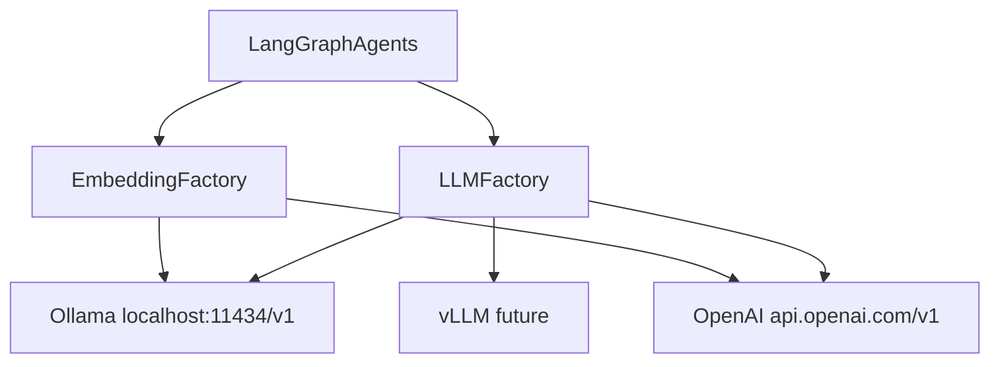

# Ollama / Open-Weight LLM Integration

Dual-provider LLM layer supporting **Ollama** (local, free, default for bare-metal dev) and **OpenAI-compatible** APIs (OpenAI, Groq, vLLM, …). Switching providers is env-only; both remain first-class. Compose does **not** start Ollama unless you pass `--profile ollama`.

---

## Goal

| Provider | Use case | Cost |
|----------|----------|------|
| **Ollama** | Local dev, MVP, CI without API keys | Free (local compute) |
| **OpenAI / compatible** | Production, Zyvor labs (e.g. Groq), Growth/Enterprise | Pay-per-token |

The app routes all chat and embedding calls through a single factory. **OpenAI is not removed or deprecated** — existing `OPENAI_API_KEY` / `OPENAI_MODEL` / `OPENAI_BASE_URL` env vars remain supported.

### Groq (and similar chat-only gateways)

Set `LLM_PROVIDER=openai`, `OPENAI_BASE_URL=https://api.groq.com/openai/v1`, and your key. Groq rejects embedding `dimensions` and has no embed API — Aurora uses a **local hash embedding** when the base URL contains `groq.com` so ingest still works for RAG indexing.

---

## Architecture



**Key insight:** Ollama exposes an OpenAI-compatible API at `http://localhost:11434/v1`. LangChain's `ChatOpenAI` and `OpenAIEmbeddings` work unchanged when you set `base_url` + a dummy key (`ollama`).

### Files

| Action | File |
|--------|------|
| Modify | `apps/api/gtm_api/config.py` |
| Create | `apps/api/gtm_api/services/llm.py` |
| Modify | `apps/api/gtm_api/services/embeddings.py` |
| Modify | 7 agent files + `routers/products.py` |
| Modify | `apps/api/gtm_api/main.py` |
| Modify | `infra/docker-compose.yml` |
| Create | `infra/scripts/pull-models.sh` |
| Modify | `.env.example`, `Makefile`, `README.md` |
| Modify | `apps/api/tests/test_api.py` |
| Create | `apps/api/tests/test_llm_integration.py` |

---

## Configuration

### Provider selection

```bash
# Option A: Ollama (default for dev)
LLM_PROVIDER=ollama

# Option B: OpenAI (production)
LLM_PROVIDER=openai
OPENAI_API_KEY=sk-...

# Option C: Auto-detect — OPENAI_API_KEY set, LLM_PROVIDER unset → openai
OPENAI_API_KEY=sk-...
```

### Provider switch matrix

| Setting | Ollama (dev default) | OpenAI (production) |
|---------|----------------------|---------------------|
| `LLM_PROVIDER` | `ollama` | `openai` |
| Base URL | `http://localhost:11434/v1` | `https://api.openai.com/v1` |
| API key | `ollama` (dummy) | `OPENAI_API_KEY=sk-...` |
| Chat models | Llama/Qwen/DeepSeek/Gemma per agent | GPT-4o / GPT-4o-mini per agent |
| Embedding model | `nomic-embed-text` | `text-embedding-3-small` |
| Embedding dims | `768` | `1536` |
| Qdrant collection | `gtm_chunks_768` | `gtm_chunks_1536` |

### Per-agent model routing

| Agent | Ollama model | OpenAI model |
|-------|--------------|--------------|
| `product_understanding` | `qwen2.5-coder:14b` | `gpt-4o-mini` |
| `marketing_strategy` | `deepseek-r1:8b` | `gpt-4o` |
| `content_studio` | `llama3.1:8b` | `gpt-4o-mini` |
| `sales_agent` | `llama3.1:8b` | `gpt-4o-mini` |
| `outreach` | `gemma2:9b` | `gpt-4o-mini` |
| `solution_architect` | `deepseek-r1:8b` | `gpt-4o` |
| `proposal_generator` | `deepseek-r1:8b` | `gpt-4o` |

### Per-agent env overrides

```bash
# Ollama
AGENT_MODEL_SALES=llama3.1:8b
AGENT_MODEL_PRODUCT_UNDERSTANDING=qwen2.5-coder:14b

# OpenAI
OPENAI_AGENT_MODEL_SALES=gpt-4o-mini
OPENAI_AGENT_MODEL_MARKETING_STRATEGY=gpt-4o
```

### Resolved runtime properties (`config.py`)

- `resolved_llm_provider()` — `ollama` | `openai`
- `llm_base_url` — provider API base URL
- `llm_api_key` — provider API key
- `embedding_model` — active embedding model name
- `embedding_dimensions` — 768 or 1536
- `qdrant_collection_resolved` — e.g. `gtm_chunks_768`
- `get_agent_model(agent_type)` — per-agent model for active provider
- `get_all_agent_models()` — map of all agents → model

---

## LLM Factory (`services/llm.py`)

```python
from gtm_api.services.llm import get_chat_model, get_provider, check_llm_health

llm = get_chat_model("sales_agent", temperature=0.2)
provider = get_provider()  # "ollama" | "openai"
health = await check_llm_health()
```

### Health checks

| Provider | Check |
|----------|-------|
| Ollama | `GET http://localhost:11434/api/tags` — lists pulled models |
| OpenAI | `OPENAI_API_KEY` present |

Startup lifespan calls `check_llm_health()` and stores result on `app.state.llm_health`.

### `/health` response

```json
{
  "status": "healthy",
  "service": "Aurora",
  "llm_provider": "ollama",
  "llm_ready": true,
  "chat_models": {
    "sales_agent": "llama3.1:8b",
    "marketing_strategy": "deepseek-r1:8b"
  },
  "embedding_model": "nomic-embed-text",
  "embedding_dimensions": 768,
  "available_models": ["llama3.1:8b", "nomic-embed-text"],
  "missing_models": []
}
```

---

## Embeddings (`services/embeddings.py`)

| Provider | Model | Dimensions | base_url |
|----------|-------|------------|----------|
| Ollama | `nomic-embed-text` | 768 | `http://localhost:11434/v1` |
| OpenAI | `text-embedding-3-small` | 1536 | `https://api.openai.com/v1` |

**Important:** Switching providers requires re-indexing. Qdrant collection names include the dimension suffix (`gtm_chunks_768` vs `gtm_chunks_1536`).

Zero-vector stub fallbacks were removed — embedding calls fail clearly if the provider is unreachable.

---

## Agent refactor pattern

**Before:**

```python
llm = ChatOpenAI(model=settings.openai_model, api_key=settings.openai_api_key or "sk-placeholder")
if not settings.openai_api_key:
    state["profile"] = {... stub ...}
    return state
```

**After:**

```python
from gtm_api.services.llm import get_chat_model

llm = get_chat_model("product_understanding", temperature=0.1)
# Works with Ollama OR OpenAI — no stub fallbacks
```

Refactored files:

- `agents/product_understanding.py`
- `agents/marketing_strategy.py`
- `agents/content_studio.py`
- `agents/sales_agent.py`
- `agents/outreach.py`
- `agents/solution_architect.py`
- `agents/proposal_generator.py`
- `routers/products.py` (query endpoint uses `sales_agent` model)

---

## Infrastructure

### Docker Compose

Optional `ollama` service on port `11434` with persistent volume `ollama_data`.

### Pull models

```bash
make ollama-pull
# or
bash infra/scripts/pull-models.sh
```

Models pulled:

- `llama3.1:8b`
- `qwen2.5-coder:14b`
- `deepseek-r1:8b`
- `gemma2:9b`
- `nomic-embed-text`

### RAM requirements (Ollama)

| Model size | Approx. RAM |
|------------|-------------|
| 8B | ~8 GB |
| 14B | ~16 GB |

On macOS, host Ollama (`brew install ollama`) is faster than Docker Ollama. Docker Ollama is recommended for Linux/CI.

---

## Quick start

See [dev-guide.md](./dev-guide.md) for full platform setup. LLM-specific steps:

```bash
make start    # or: make infra-up && make api

# Option A: Ollama (default)
brew install ollama && ollama serve && make ollama-pull

# Option B: OpenAI
# Set LLM_PROVIDER=openai and OPENAI_API_KEY in .env

# Verify
curl http://localhost:8000/health
make test
```

---

## Testing

Tests live in `apps/api/tests/`. Run with:

```bash
cd apps/api && python -m pytest tests/ -v
# or from repo root
make test
```

### Unit tests (`test_api.py` → `TestLLMFactory`)

These tests validate configuration and factory wiring **without** calling live Ollama or OpenAI.

| Test | What it verifies |
|------|------------------|
| `test_ollama_provider_defaults` | Ollama base URL, sales agent model, 768-dim embeddings, `gtm_chunks_768` collection |
| `test_openai_provider_config` | OpenAI key, marketing strategy → `gpt-4o`, 1536-dim embeddings |
| `test_auto_detect_openai_when_key_set` | `OPENAI_API_KEY` without `LLM_PROVIDER` → auto-selects OpenAI |
| `test_provider_switch_per_agent` | Same agent resolves different models per provider |
| `test_get_chat_model_uses_provider_base_url` | `ChatOpenAI` gets correct `model_name` and `openai_api_base` |
| `test_agent_env_override` | `AGENT_MODEL_SALES` overrides default Ollama model |

Example:

```python
def test_ollama_provider_defaults(self, monkeypatch):
    monkeypatch.delenv("OPENAI_API_KEY", raising=False)
    monkeypatch.setenv("LLM_PROVIDER", "ollama")
    get_settings.cache_clear()
    settings = get_settings()
    assert settings.resolved_llm_provider() == "ollama"
    assert settings.llm_base_url == "http://localhost:11434/v1"
    assert settings.get_agent_model("sales_agent") == "llama3.1:8b"
    assert settings.embedding_dimensions == 768
    assert settings.qdrant_collection_resolved == "gtm_chunks_768"
```

### Integration tests (`test_llm_integration.py` → `TestLLMIntegration`)

These tests exercise cross-module behavior: health service, FastAPI `/health`, and embedding service config. HTTP to Ollama is **mocked** so CI runs without GPU or API keys.

| Test | What it verifies |
|------|------------------|
| `test_embedding_dimensions_per_provider` | 768 (Ollama) vs 1536 (OpenAI) on `EmbeddingService` |
| `test_embedding_service_client_config_ollama` | Embedding client uses Ollama base URL and model |
| `test_embedding_service_client_config_openai` | Embedding client uses OpenAI base URL, model, dimensions |
| `test_check_llm_health_ollama_reachable` | Mocked `/api/tags` → `llm_ready=True`, models listed |
| `test_check_llm_health_ollama_unreachable` | Connection failure → `llm_ready=False`, error message |
| `test_check_llm_health_openai_with_key` | Key present → `llm_ready=True` |
| `test_check_llm_health_openai_missing_key` | No key → `llm_ready=False`, message set |
| `test_check_llm_health_reports_missing_models` | Configured model not in Ollama tags → `missing_models` |
| `test_health_endpoint_includes_llm_status` | `GET /health` returns `llm_provider`, `embedding_model`, etc. |

Example (mocked Ollama health):

```python
@pytest.mark.asyncio
async def test_check_llm_health_ollama_reachable(self, monkeypatch):
    monkeypatch.setenv("LLM_PROVIDER", "ollama")

    async def mock_get(url):
        return MockResponse(200, {"models": [{"name": "llama3.1:8b"}]})

    with patch("gtm_api.services.llm.httpx.AsyncClient") as mock_client:
        mock_client.return_value.__aenter__.return_value.get = AsyncMock(side_effect=mock_get)
        result = await check_llm_health()

    assert result["llm_provider"] == "ollama"
    assert result["llm_ready"] is True
    assert "llama3.1:8b" in result["available_models"]
```

### Manual / live integration (optional)

Run these when Ollama is serving locally:

```bash
# 1. Start Ollama and pull models
ollama serve
make ollama-pull

# 2. Start API
LLM_PROVIDER=ollama make api

# 3. Check health
curl -s http://localhost:8000/health | jq

# 4. Smoke-test chat (requires ingested product data)
curl -X POST http://localhost:8000/api/v1/products/{id}/query \
  -H "Authorization: Bearer $TOKEN" \
  -H "Content-Type: application/json" \
  -d '{"question": "What does this product do?"}'
```

For OpenAI live test:

```bash
LLM_PROVIDER=openai OPENAI_API_KEY=sk-... make api
curl -s http://localhost:8000/health | jq '.llm_provider, .llm_ready'
```

---

## Out of scope (future)

- vLLM provider adapter (same OpenAI-compatible interface)
- Tenant-level model selection (Enterprise Phase 12)
- HuggingFace Transformers in-process
- GPU scheduling in Kubernetes

---

## Troubleshooting

| Symptom | Cause | Fix |
|---------|-------|-----|
| `llm_ready: false`, Ollama message | Ollama not running | `ollama serve` or `docker compose up ollama` |
| `missing_models` in health | Model not pulled | `make ollama-pull` or `ollama pull <model>` |
| Qdrant dimension mismatch | Switched provider without re-index | Re-ingest with new provider; collection suffix changes |
| Slow inference on Mac Docker | Docker Ollama overhead | Use host Ollama via `brew install ollama` |
| Auto-selected OpenAI unexpectedly | `OPENAI_API_KEY` set in env | Unset key or set `LLM_PROVIDER=ollama` |
